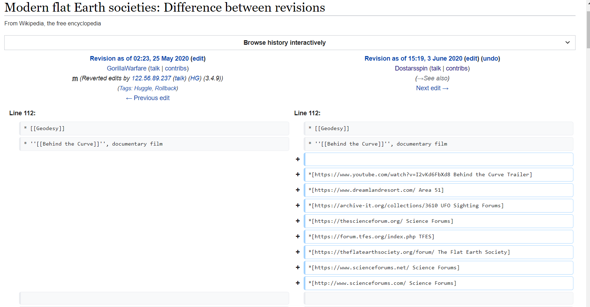
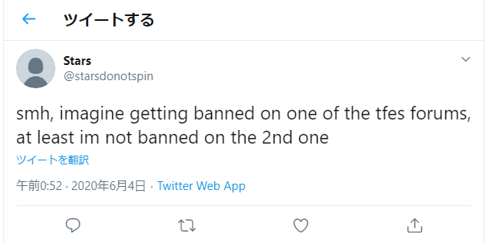
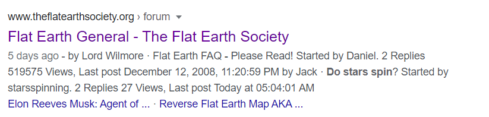
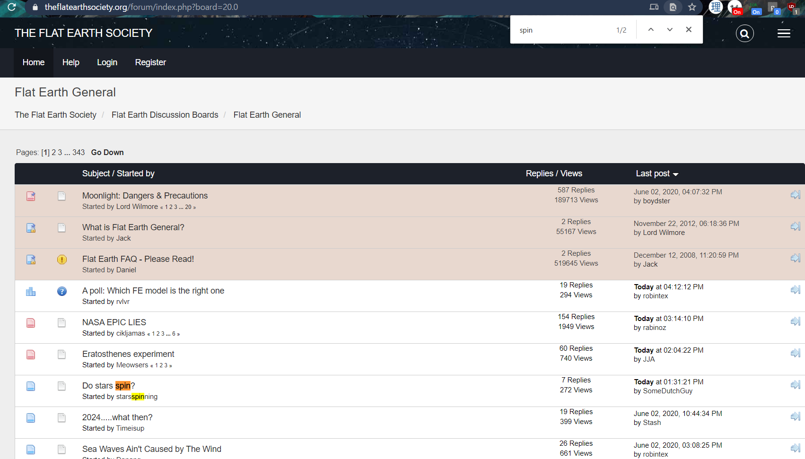
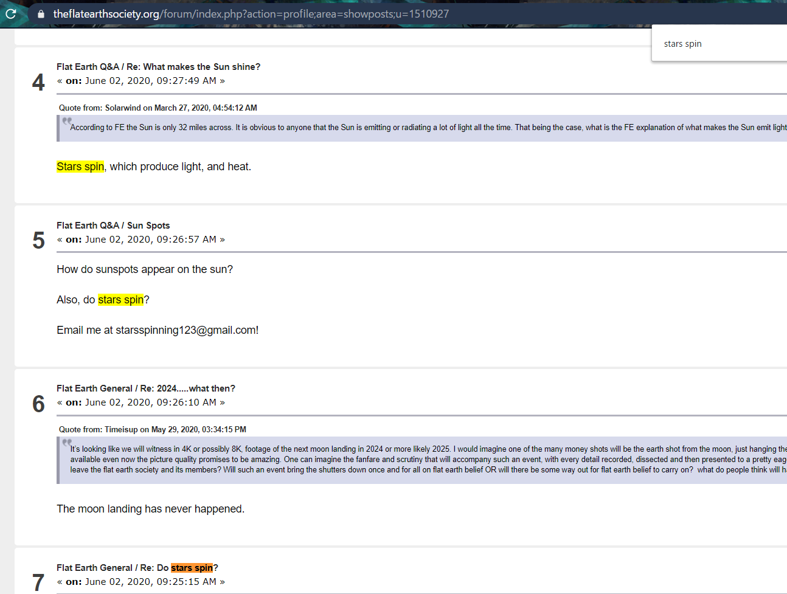
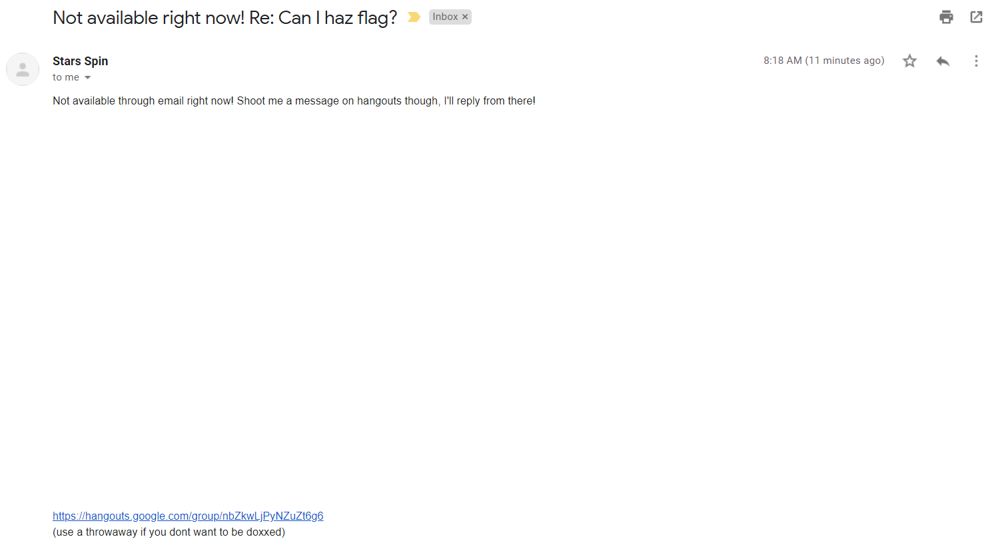
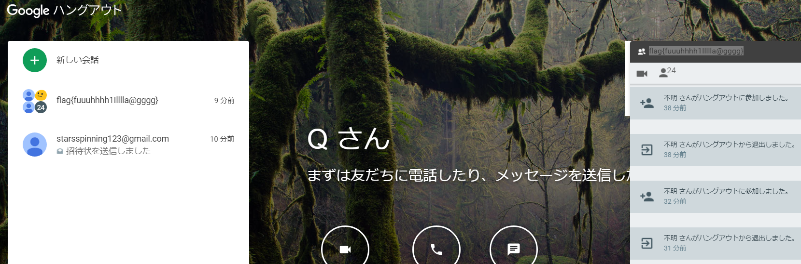

I played with CTF.SG and solved all the OSINT challenges in the Misc category!

---

# Do Stars Spin? 1

#### Category: osint, misc 

```
PMP was walking by earlier, muttering something about "stars". I think he's said something about it before. I also want to know: do stars spin? I'd search for it, but I'm too busy. I think he's mentioned something about stars somewhere…help me out?

Author: JC01010
```

I actually solved this before the hint was released. In fact, I was kinda angry that the author released *multiple* hints for an already solved challenge.

With something as vague as this and the Discord button standing out from the usual CTFd interface, I decided to join the Discord.

The oldest message in the `#general` channel was this:

```
PMP05/24/2019
does anyone actually use this server

Hello, HSCTF 7!
I'm sure we've all asked the age-old question: Do stars even spin? (No, we haven't. JC put me up to this.)
Hm, I wonder… dostarsevenspin? Time to ask reddit!
cuz it sure looks like no one does
```

From here, we got 2 keywords: `dostarsevenspin` and `reddit`.

Searching reddit quickly brings us to a post by user `dostarsevenspin` claiming that his account has been hacked and posts deleted.

Searching more on google again, we get a [deleted post that references the BEE SCRIPT](https://www.reddit.com/user/dostarsevenspin/)

Since using the usual `ceddit` and `removeddit` didn't work - probably because the post was deleted in 10 min and was not on a subreddit but on a user page, I had to resort to the Wayback Machine, which returns a page with all the deleted posts from the user.

This is the [page](https://web.archive.org/web/20200527041338/https://www.reddit.com/user/dostarsevenspin/)

The flag is printed twice on the page, which gives us the solve! 

<details>
    <summary>FLAG</summary>
    
    flag{7t3rE_i5_n0_wAy_a_be3_sh0u1d_BEE_ab13_t0_f1Y_89a89fe1}
</details>

---

# Do Stars Spin? 2

#### Category: osint, misc 

[On page that gave the flag](https://web.archive.org/web/20200527041338/https://www.reddit.com/user/dostarsevenspin/) in the last challenge, the most recent post was a hint pointing to [dostarsevenspin's instagram](http://instagram.com/dostarsevenspin).

```
Hey, I need help on my instagram profile
How do I delete posts? Here is my handle: @ dostarsevenspin
```

As there is no way to recover a deleted instagram or twitter post of another user, unless you have cached it beforehand, I knew it was a red herring, especially since the profile listed links to his Twitter and Snapchat as well.

```
Stars Spin?
Twitter: starsdonotspin
Reddit: dostarsevenspin
Sc: starsspinn't
Follow me for free flag (dm too)
^imagine falling for that
flag{no}
```

As we all know, Snapchat deletes posts after 24 hours so I didn't even bother looking there.

So I went to the Twitter page and noticed [a tweet](https://twitter.com/starsdonotspin/status/1266119748737290242) where he linked to 2 wikipedia pages

Go to Wikipedia page > View History > and you'll notice his contribution and revert on [Spin Stars](https://en.wikipedia.org/w/index.php?title=Spin_Star&action=history)

Sadly neither the `Spin Stars` nor `Stars` page gave any details.

However, when you go to his profile and [list his contributions](https://en.wikipedia.org/wiki/Special:Contributions/Dostarsspin), there is an edit on the Wikipedia entry for [Flag](https://en.wikipedia.org/w/index.php?title=Flag&oldid=959455544) which gave the flag.

Here is the exact section for your viewing pleasure:     
https://en.wikipedia.org/w/index.php?title=Flag&oldid=959455544#Flapping

<details>
  <summary>FLAG</summary>
  
flag{te3_6ov3rnM3n7_i5_h1d1ng_1nf0!}
</details>

--- 

# Do Stars Spin? 3

#### Category: osint, misc 

Continuing from the previous part, lets look at the user's posts.

There was [one edit which pointed to a freenode IRC channel](https://en.wikipedia.org/w/index.php?title=Internet_Relay_Chat&diff=prev&oldid=959459201) #starsdonotspin, but that was a red herring.

Going on, I noticed the user's largest edit was on [this wikipedia page](https://en.wikipedia.org/w/index.php?diff=960548445).



It has a list of links, so lets check them one by one. 

### [Youtube](https://www.youtube.com/watch?v=I2vKd6FbXd8)     
Most recent comment was one about stars spinning, but it was created AFTER the CTF has started so lets ignore that. It's probably by a player and not the challenge creator. The other comments were unrelated so lets move on to the next link.

### [Area 51 Site](https://www.dreamlandresort.com/)     
It looked too geocities, so I skipped it upon opening and put it in the backlog.

What caught my eye next was `*[https://forum.tfes.org/index.php TFES]` and `*[https://theflatearthsociety.org/forum/ The Flat Earth Society]`. You see, there was actually a hint on [the Twitter](https://twitter.com/starsdonotspin/status/1268209028414484481) about `TFES`, `forums` and `more than 1`. 



So i went straight to them.

Using Google, I found that someone posted about stars spinning has made a recent post on the [latter site](https://www.theflatearthsociety.org/forum/index.php?board=20.0).



The link was still live and I didn't have to use cache or webarchive.



Going through the user's post history, I noticed [one post](https://www.theflatearthsociety.org/forum/index.php?topic=86066.msg2254895#msg2254895) where the user posted his email address and clearly said to Email him.



At this point, I felt like a guess god, and I knew that this was the answer as I sent my email and got an automated reply within 1 minute.



I opened the [Hangouts link](https://hangouts.google.com/group/nbZkwLjPyNZuZt6g6) sent in the automated reply, and there was the flag.



<details>
  <summary>FLAG</summary>
  
flag{fuuuhhhh1Illlla@gggg}
</details>

##### Total time spent: 30 minutes + 20 minutes + 20 minutes
