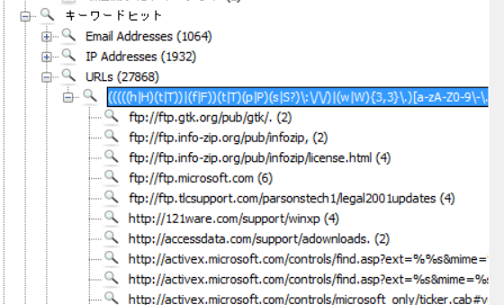
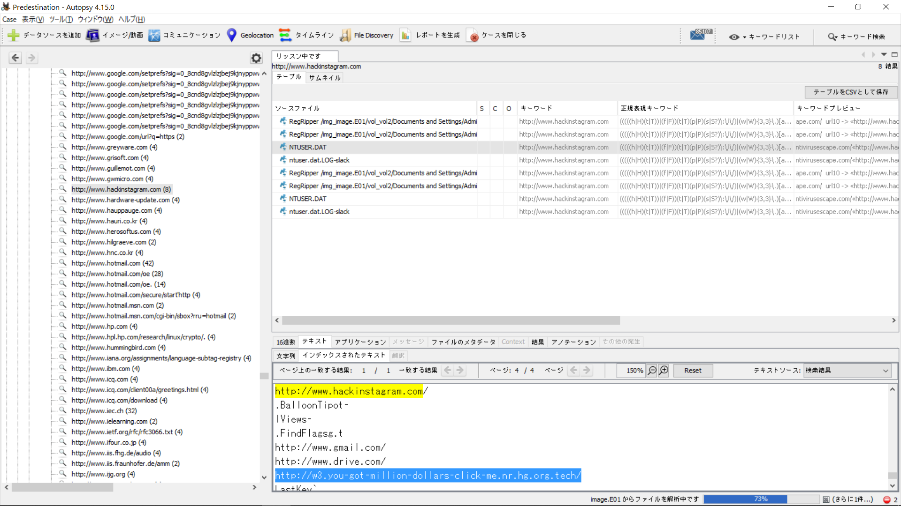

There was so much guess... so much guess that I gave up and only did this category and some of the other Forensics which were copied challenges from other CTFs.

MVP goes to the Google Source Code challenge, we found out AFTER the CTF that someone deleted the hints like phpinfo because it was an unrestricted sandbox, and occasionally someone would do an `rm -rf` so the whole website returned 403 Forbidden. Also according to the challenge creator, it is not guess.

Anyway, enough of that. 

---

## Digital Forensics

# PreDestination

#### Category: Digital Forensics | 42 solves | 482 points

  
Challenge Description

  
  MR.Zh3r0 is a mathematician who loves what he does, he loves music and he is fairly good; like an average joe, with personal desktops but a really gullible person who could be phished or scammed easily! He had some bad colleagues in his office that led him to have some bad intentions towards them. One of his "HECKER" friend suggested to download some virus to destroy the data the other people has. As you would expect, this backfired. He has called the World's best forensics experts to come to his rescue! We were fortunately able to get his PC's image and some of the files in it. And We have a suspicion if he only downloaded one malware or more than one? And we need answers to some questions that follow, this would be your first assignment!

We found that his PC had some sort of problem with Time Zones even though he tries to reset it, it seems the malware is somehow able to edit the TimeZone to the malware author's name. How could a malware edit the TimeZone information if it had Administrator Privilege to the system!?

Note:- File for the challenges in this series is the same

Author : Amun-Ra

Flag format - zh3r0{authorname}

The challenge description mentions Timezones, and about how the Timezone is changed to the malware author name, which is the flag.

So we want to look for the TimeZone registry entry, typically found in `HKEY_LOCAL_MACHINE\SYSTEM\CurrentControlSet\Control\TimeZoneInformation`. 

Under the `StandardName` key, we see the value `Cicada3310`, which is the flag.

  
FLAG

  
  zh3r0{Cicida3310}

------

# Good Ol' IE

#### Category: Digital Forensics | 42 solves | 496 points

This one stumped me for a day. I actually gave up on it and then came back 2 hours before the CTF ended and suddenly had the inspiration to look at the URL list manually, one by one.

My keyword searcher grep'd a total of 27868 URLs, but they are grouped by location so the actual unique URL is actually much smaller - maybe around 1000 at most. 

So I started from the bottom of the list and curl'd any suspicous URL I found - that is, stuff that are not microsoft or msn or other common software (eg. apache) links. The hint also says the victim is gullible, so we are looking for an interesting link.

I scrolled until I found hackinstagram.com, which unfortunately was a red herring. However, in the same registry file a few lines down, there was this link that did not exist http://w3.you-got-million-dollars-click-me.nr.hg.org.tech/ , or at least the HTTP ports were not accesible.

So I wrapped it in the CTF flag tags and it was the correct flag!

  
FLAG

  
  zh3r0{http://w3.you-got-million-dollars-click-me.nr.hg.org.tech/}

------

# Soundless

#### Category: Digital Forensics | ? solves | 496 points

  
Challenge Description>

  
  Good job in finding the flag! We have found traces of yet another malware! The information we have is that MR.Zh3r0's music folder isn't really a music folder,(i.e), he's music folder seems to trigger the virus software somehow whenever he clicks it! Now he can't even open his default music folder to hear some good musics! We have a certain idea that somehow the virus might be redirecting the clicks to a different location where the virus resides or the location of music folder could be compltely different! You can find the flag at the right place when you look, it will be obvoius when u look at it!

Note:- File for the challenges in this series is the same

Author : Amun-Ra

Flag format - zh3r0{path to the malware file}

This was also pretty easy! The description basically says to find where the location of `My Music` is, so we go to the registry for `Current User` and look for where `My Music` points to. 

I found the path by going to my own computer's `regedit` and searching for `My Music`, which gave me the path `HKEY_CURRENT_USER\Software\Microsoft\Windows\CurrentVersion\Explorer\Shell Folders` and all I had to do was to find the same folder in the `Image.E01`.

  
FLAG

  
  zh3r0{Hades.exe}

------

# UnRemovable

#### Category: Digital Forensics | ? solves | 497 points

Placeholder

------

# Run Forrest Run

#### Category: Digital Forensics | ? solves | 498 points

Placeholder

------

# Farewell

#### Category: Digital Forensics | ? solves | 10 points

Placeholder

------

## Forensics

# Snow

#### Category: Forensics | 126 solves | 325 points

We are given a file that cannot be unzipped on a Windows filesystem (I tried). Unzipping it on Mac messes up the filenames, so I did it on the latest Ubuntu 18.

After unzipping and doing `cd snow`, I present to you my one-line solution:

`stegsnow -C -p $(cat .snowey/.../.../.secret.txt) chall.txt`

This will return the flag. Thanks to the creator of stegsnow.

  
FLAG

  
  zh3r0{i5_it_sn0w1ng?}

