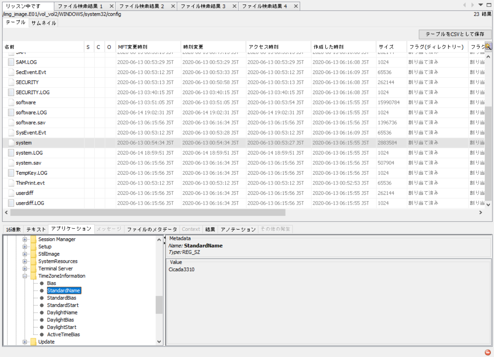

There was so much guess... so much guess that I gave up and only did this category and some of the other Forensics which were copied challenges from other CTFs.

MVP goes to the Google Source Code challenge, we found out AFTER the CTF that someone deleted the hints like phpinfo because it was an unrestricted sandbox, and occasionally someone would do an `rm -rf` so the whole website returned 403 Forbidden. Also according to the challenge creator, it is not guess.

Anyway, enough of that. 

---

# Digital Forensics

# PreDestination

#### Category: Digital Forensics | 42 solves | 482 points

The challenge description mentions Timezones, and about how the Timezone is changed to the malware author name, which is the flag.

So we want to look for the TimeZone registry entry, typically found in `HKEY_LOCAL_MACHINE\SYSTEM\CurrentControlSet\Control\TimeZoneInformation`. 

Under the `StandardName` key, we see the value `Cicada3310`, which is the flag.

  
FLAG

  
  zh3r0{Cicida3310}

---

# Good Ol' IE

#### Category: Digital Forensics | 42 solves | 496 points

Redacted

Challenge authors told us not to release the writeup yet, so I'll respect their decision.

---

# Soundless

#### Category: Digital Forensics | ? solves | 496 points

Placeholder

---

# UnRemovable

#### Category: Digital Forensics | ? solves | 497 points

Placeholder

---

# Run Forrest Run

#### Category: Digital Forensics | ? solves | 498 points

Placeholder

---

# Farewell

#### Category: Digital Forensics | ? solves | 10 points

Placeholder

---

# Forensics

# Snow

#### Category: Forensics | 126 solves | 325 points

We are given a file that cannot be unzipped on a Windows filesystem (I tried). Unzipping it on Mac messes up the filenames, so I did it on the latest Ubuntu 18.

After unzipping and doing `cd snow`, I present to you my one-line solution:

`stegsnow -C -p $(cat .snowey/.../.../.secret.txt) chall.txt`

This will return the flag. Thanks to the creator of stegsnow.

  
FLAG

  
  zh3r0{i5_it_sn0w1ng?}

