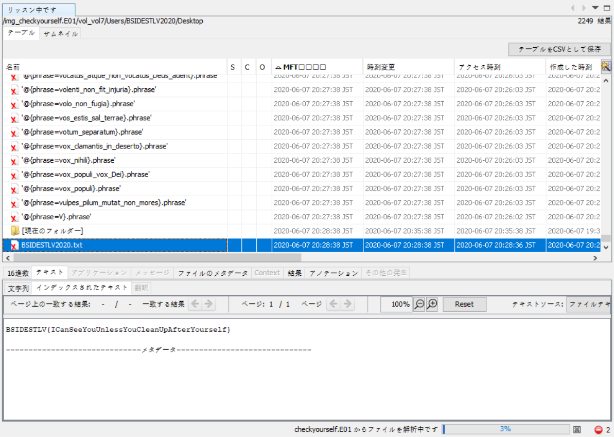

I participated with CTF.SG again, but as most of us were burnt out from 0ctf, we didn't have the full force this time around.

The site uses fixed scoring and not dynamic, so some questions were determined to be easier than others.

---

## Forensics

---

# Check yourself so you won't wreck yourself

#### Category: Forensics | 42 solves | 100 points

  
Challenge Description

  
  Dumbster diving.

<a href="http://bsidesctf.s3-website.eu-central-1.amazonaws.com/checkyourself.7z">File Download Link</a>

The challenge description mentions Dumpster, which means Garbage Bin - thus we check the Recycle Bin.
When I first opened it, I saw many recycled `phrases`, like over 1000 files maybe, so I knew it was the right place.
As we are searching for something that stands out, let's sort by file type to filter out all these `phrases`.

Upon doing so, I found a very obvious `BSIDESTLV2020.txt`, which I opened and there was the flag!

  
FLAG

  
  BSIDESTLV{ICanSeeYouUnlessYouCleanUpAfterYourself}

***

# MoreWithLess

#### Category: Forensics | 29 solves | 200 points

  
Challenge Description

  
  You need some EFF in your life.

<a href="http://bsidesctf.s3-website.eu-central-1.amazonaws.com/MoreWithLess.E01">File Download Link</a>

From what I can tell, EFF refers to Electronic Frontier Foundation, which doesn't mean anything for us.

So what can be better with less, in a computer context? Maybe your browsing history?

Hence I went to check for browser history! First IE... nope nothing there.

So I continued looking for something that stood out... this time it was Chrome History!

Unfortunately I deleted the 8 GB image so I don't have a screenshot now.

And we've found the flag!

  
FLAG

  
  BSIDESTLV2020{HideYourNeedleInTheHayStack}

---
