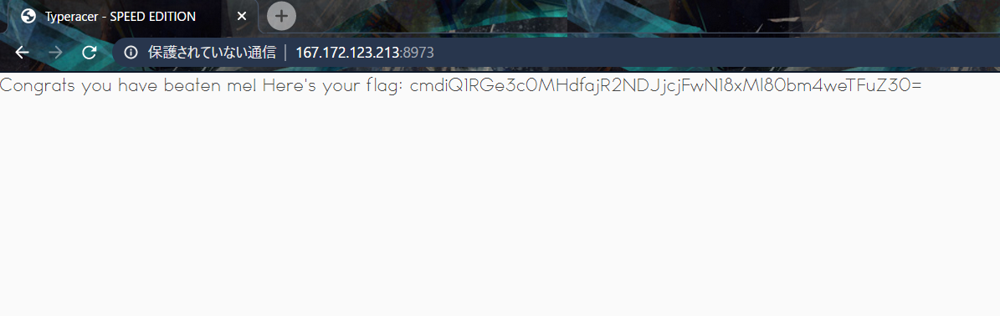
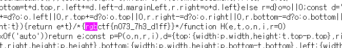
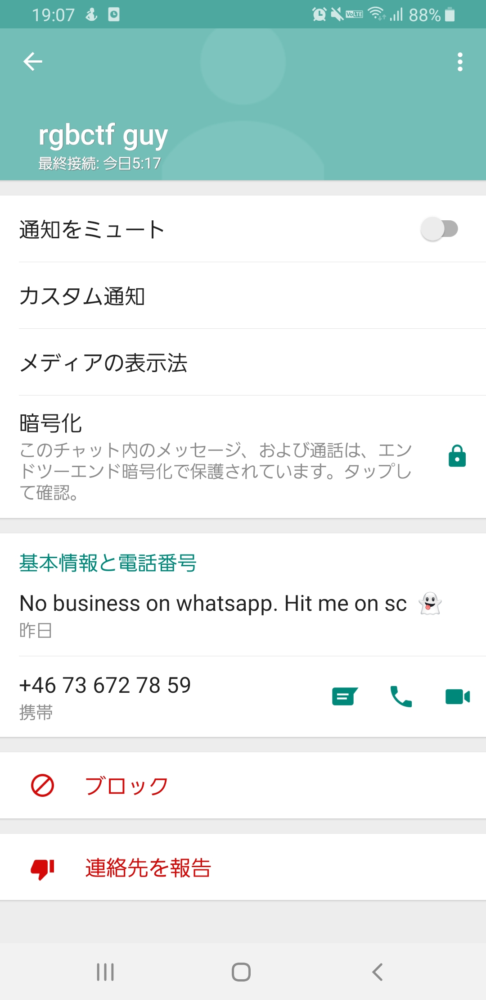
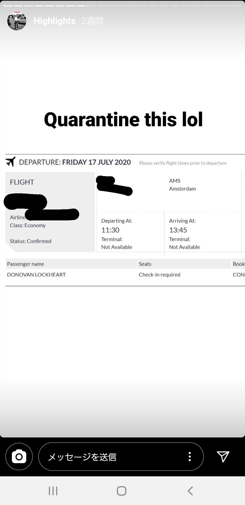
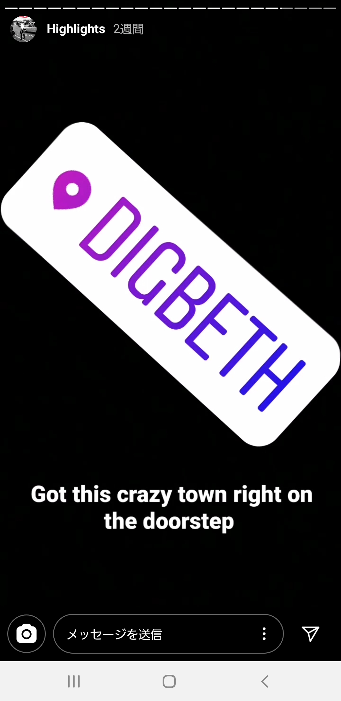
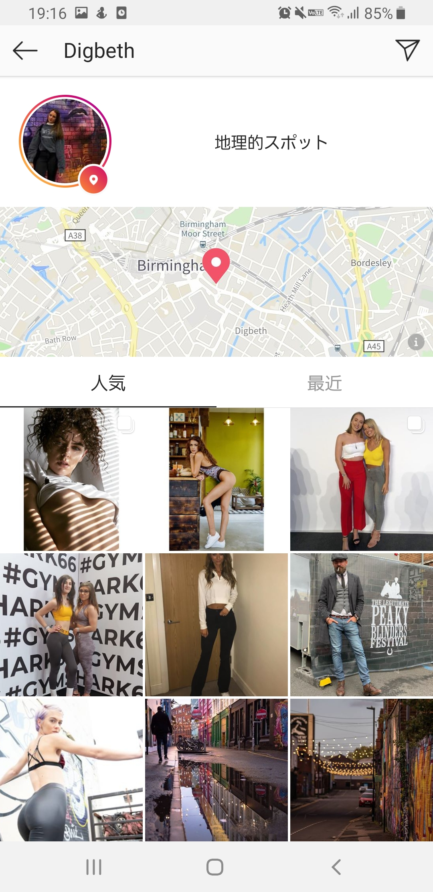
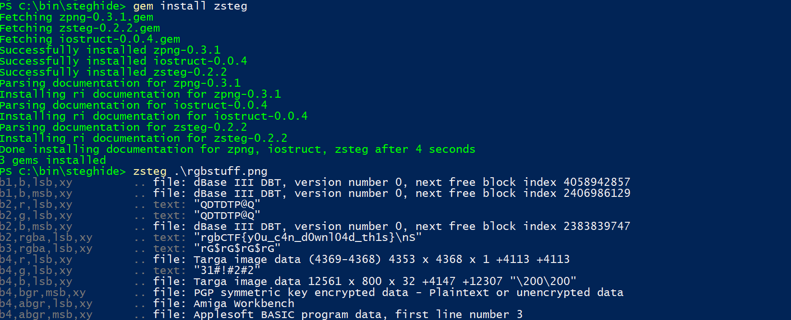

I participated with Defenit and CTF.SG and mostly worked on the Web. Or I should say Misc, since all the Web felt like Misc. The 3-part OSINT series was fun though! 

I also solved the programming challenges in Misc, and some other Guess challenges...

---

## Web

---

# Tic Tac Toe

#### Category: Web | 333 solves | 50 points

<details>
  <summary>Challenge Description</summary>
  
Hello there, I invite you to one of the largest online global events in history ... the Tic Tac Toe World Championships!
http://challenge.rgbsec.xyz:8974/

<br />
~BobbaTea#6235, bAse#0001
</details>

This is a javascript game cheating challenge.

We noticed that `window["_0x2c3b80"]` contains the game state in base64. Decoding it, we got the flag!


<details>
  <summary>FLAG</summary>
  
  BSIDESTLV{ICanSeeYouUnlessYouCleanUpAfterYourself}
</details>

***

# Typeracer

#### Category: Web | 184 solves | 119 points

<details>
  <summary>Challenge Description</summary>
  
I AM SPEED! Beat me at TypeRacer and the flag is all yours!
http://challenge.rgbsec.xyz:8973/

<br />
~BobbaTea#6235, bAse#0001
</details>

This is another javascript game cheating challenge, but let's see if we can solve it without calling any function.

Turning on the debugger, add a breakpoint when the time is changed.

This will cause the game to freeze with the text visible.

Type the text into your favourite text editor, then use an automation tool like AutoHotKey send it back to the browser. There's a function checking for keystrokes, so directly copy-pasting it would not work.

This was my code which led me to the flag:

```
Sleep 1000

Send loose rather smaller ever proper plane yes letter heard draw available least gulf grow deal please accurate ear result whose judge modern bound generally seen jack why cup keep union saved fish harbor eleven depth door excellent go nothing tomorrow cotton problem finger charge trip knowledge nervous ahead due carried
```

Btw you can also beat it manually if you have a wpm of around 200. I tried and failed it with 163:
`Congrats you have a WPM of 163.33333333333334! Unfortunately, only keyboarding legends can redeem the flag. Perhaps, try again?`

And we got a flag encoded in base64:



<details>
  <summary>FLAG</summary>
  
  rgbCTF{w40w_j4v42cr1p7_12_4nn0y1ng}
</details>

***

# Countdown

#### Category: Web | 63 solves | 455 points

<details>
  <summary>Challenge Description</summary>
  
This challenge is simple. All you have to do is wait for the countdown to end to get the flag. The countdown ends one second before the end of the CTF, but you have fast fingers right?

http://challenge.rgbsec.xyz:5000/

<br />
~Quintec#0689
</details>

We are given a page where there is a countdown that ends 1 second before the CTF ends, as the challenge description says.

First I tried modifying my system clock, but it only led the timer to count down to negative.

This led me to believe that it is not a javascript game cheating challenge like the previous two, but one that involves server-side processing instead.

Taking a look at the session cookie and the logic of the javascript on the page:

```javascript
window.addEventListener('load', function() {
			    var cookie = Cookies.get('session');
			    var data = cookie.split('.')[0].replace(/_/g, '/').replace(/-/g, '+');
			    var data = JSON.parse(atob(data));
			    var end = moment.utc(data['end']);
			    setInterval(function() {
			    	var dur = moment.duration(end.diff(moment.utc()));
			    	var disp = dur.get("days") + "d " + dur.get("hours") + "h " + dur.get("minutes") + "m " + dur.get("seconds") + "s";
			    	document.getElementById("countdown").innerHTML = disp; 
			    }, 1000);
			});
```

We see that the variable `end` is a date hardcoded into the cookie. This means we can modify it and the server will hopefully read our input without sanitization.

However, we notice that the cookie has some extraneous characters at the end `eyJlbmQiOiIyMDIwLTA3LTEzIDE2OjU5OjU5KzAwMDAifQ.Xwu32g.eGyibsd0-7vE_XZSZrczJOWT7pU`, which was not JWT as JWT uses dot separators.

Doing a quick google search, it turned out to be a flask cookie. But we needed a key for that!

This was where Justin came in and said

> But what if `Time` is key?

That's right, the key was hiding in plainsight just above the countdown timer.

Using the code of [this stackoverflow answer](https://stackoverflow.com/a/42289001/4420129), we write the following script:

```python
from flask import Flask, session
from flask.sessions import SecureCookieSessionInterface

app = Flask("example")
app.secret_key = "Time"

session_serializer = SecureCookieSessionInterface() \
                         .get_signing_serializer(app)

@app.route("/")
def test():
    session["end"] = "2020-07-10 16:59:59+0000"

    session_cookie = session_serializer.dumps(dict(session))
    return session_cookie

app.run(host="0.0.0.0")
```

Which will change the end date and encrypt it into this flask cookie: `eyJlbmQiOiIyMDIwLTA3LTEwIDE2OjU5OjU5KzAwMDAifQ.XwpcKA.JP9x_llcMpcXoTJdt1KRF7nxEMg
`

Which gave us the flag!

<details>
  <summary>FLAG</summary>
  
  rgbCTF{t1m3_1s_k3y_g00d_j0k3_r1ght}
</details>

***

# Imitation Crab

#### Category: Web | 68 solves | 448 points

<details>
  <summary>Challenge Description</summary>
  
Flag should be modified to fit the rgbCTF format (rgbCTF{flag}, underscores between words)
http://challenge.rgbsec.xyz:7939/

<br />
~BobbaTea#6235
</details>

I'll be honest, we got stuck on it until our pwn guy [Lord_Idiot](https://twitter.com/__lord_idiot) came in and showed us the `robots.txt` link: http://167.172.123.213:7939/robots.txt

Which showed [a path](http://167.172.123.213:7939/static/export.har) to the `/static/export.har`, where a `.har` file could be downloaded.

Trawling through the large file, we find the text: `RGBCTF H4R F1L3S 4R3 2UP3R US3FU1`

And encoded it in the flag format, which gave us the 13th solve.

<details>
  <summary>FLAG</summary>
  
  rgbCTF{H4R_F1L3S_4R3_2UP3R_US3FU1}
</details>

***

# Keen Eye

#### Category: Web | 30 solves | 490 points

<details>
  <summary>Challenge Description</summary>
  
Pay close attention... http://challenge.rgbsec.xyz:8376/

<br />
~BobbaTea#6235, bAse#0001
</details>

Credits go to [@03sunf](https://twitter.com/03sunf) for this one.

There was a `cdn` link to a suspicious JS called `poppers.min.js`. The usual package is `popper.min.js` so there was an extra `s` in there.

By grepping it, we found the flag.



What we tried and failed:

- Request smuggling (it worked randomly)
- HTTP headers

<details>
  <summary>FLAG</summary>
  
  rgbctf{n073_7h3_d1ff}
</details>

---

## Misc

---

# \[insert creative algo chall name\] 

#### Category: Misc | 67 solves | 449 points

<details>
  <summary>Challenge Description</summary>
  
https://pastebin.com/pKNVLkTs


<br />
~BobbaTea#6235, qpwoeirut#5057

</details>

This was a programming challenge, as you can tell from the description.

So basically `n` generates a list of `n` elements, and `x` defines the number of partitions.

Using this code ~~I wrote myself~~ I got from [stackoverflow](https://stackoverflow.com/a/18354471/4420129):

```python
import sys

def clusters(l, K):
    if l:
        prev = None
        for t in clusters(l[1:], K):
            tup = sorted(t)
            if tup != prev:
                prev = tup
                for i in xrange(K):
                    yield tup[:i] + [[l[0]] + tup[i],] + tup[i+1:]
    else:
        yield [[] for _ in xrange(K)]

def neclusters(l, K):
    for c in clusters(l, K):
        if all(x for x in c): yield c
    
if __name__ == "__main__":
    maxi = int(sys.argv[1])
    K = 4
    L = [1,2,4,8,16,32,64,128,256,512,1024,2048]
    clust = neclusters(L,K)
    
    ans = [clust.next() for _ in xrange(maxi)]
    print(len(ans))
```

We can start off with a large xrange number `10000000` and decrease it by one digit until we get a number returned. Then we increase it back up to half of the previous (in this case, `500000`) and keep increasing the first digit until it hits `StopIteration` again. After we have fixed the first digit, move on to the next digits and do the same.

Eventually you'll reach the answer which is `611501`. Wrap it in flag tags and we've got the flag.


<details>
  <summary>FLAG</summary>
  
  rgbCTF{611501}
</details>

***

# \[another witty algo challenge name\]

#### Category: Web | 90 solves | 409 points

<details>
  <summary>Challenge Description</summary>
  
This is pretty simple. You get a list of 5000 by 5000 grid of ones and zeros, and you have to print the number of islands in the grid.
<br />
An island is a collections of ones where each one is adjacent to another one in the island. For a cell to be adjacent to another cell, they must share an edge.
<br />
Submit the number wrapped in the flag format, like rgbCTF{123}

<br />
~ BobbaTea#6235, qpwoeirut#5057

</details>

This was another programming challenge, as you can tell from the description.

It is the classic iteration of the very common interview question 'Count the Islands', down to the detail where one '1' is one island, and to be counted as an island, they must be touching either horizontally or vertically.

You can find solutions in your favourite scripting language online because it's just that common. 

- [Java](https://www.programcreek.com/2014/04/leetcode-number-of-islands-java/)
- [Python](https://leetcode.com/problems/number-of-islands/discuss/56340/Python-Simple-DFS-Solution)

And you don't even need to optimize it, since you are running it locally with a fixed input.

```python
class Solution(object):
    def numIslands(grid):
        cnt_land = 0
        q = []
        d = [[-1,0,1,0],[0,-1,0,1]]
        len_y = len(grid)
        if len_y ==0 :
            return 0
        len_x = len(grid[0])
        if len_x == 0:
            return 0
        for i in range(len_y):
            for j in range(len_x):
                if grid[i][j] == "1":
                    grid[i][j] = "-1"
                    q.append((i,j))
                    while q :
                        cur = q.pop(0)
                        for k in range(4):
                            next_y = cur[0]+d[0][k]
                            next_x = cur[1]+d[1][k]
                            if next_y >= 0 and next_y <len_y and next_x >=0 and next_x <len_x and grid[next_y][next_x] == "1":
                                grid[next_y][next_x] ="-1"
                                q.append((next_y, next_x))
                    cnt_land +=1
        return cnt_land

f = open('grid.txt')
grid = []
for i in range(5000):
    a = list(f.readline()); del a[-1]; grid.append(a)

g = Solution.numIslands(grid)
print(g)
```
Code by [@realsung](https://twitter.com/howrealsung)

This prints `119609`. Wrap it in flag tags and we've got the flag.


<details>
  <summary>FLAG</summary>
  
  rgbCTF{119609}
</details>


---

## Forensics/OSINT

---

# PI 1: Magic in the Air

#### Category: Forensics | 160 solves | 468 points

<details>
  <summary>Challenge Description</summary>
  
We are investigating an individual we believe is connected to a group smuggling drugs into the country and selling them on social media. You have been posted on a stake out in the apartment above theirs and with the help of space-age eavesdropping technology have managed to extract some data from their computer. What is the phone number of the suspect's criminal contact?
<br />
flag format includes country code so it should be in the format: rgbCTF{+00000000000}


<br />
~Klanec#3100

</details>

The goal is to find the phone number of our target.

This is a btsnoop file, so basically bluetooth capture. I have solved a similar challenge back in [ISITDTU Finals 2019](https://github.com/Isopach/CTF-Writeup/blob/master/isitdtu-finals-2019/web/mouse.md) last year, where we had to decode a mouse capture based on hex values.

Decoding it, we get a conversation with the phone number. 

```
YOO MAN
SORRRY FOR THHE DELAY  LOL

TRYIINNG TO GEET  TYITHHIS  KEYBBOARD WORKIINNNNN

YEEEAA  ITS  NNEEW WIRELESS MANG 

BEEEN MMOVVIINNG  PPRODUCT

SSPEAAKIINNNN  OF YOOU NNEEDED TOO CCOONNTAACT  MMY  BOY RIGHT

YE

SHOOULDD  BBE FFIINE JUST SSAAY JOHNNY H SENT YOOU

ALRIGHHT LEMME GEET YOOUU  THEE  NUMBEER

HHOLD UUP IMM  LOOOKIINGG FORR  IT


ITSS  HHISS  BBURNER GOTT  IIT WWRITTTENN DOWNN SSOOMMEWHERE


YEEAHH GOT IT

00736727859

MIIND IT  IS AA SSWWWEDISHH NNUMBEER HE GGOT  IT  OONN HHOLLIDAAY THEERE FFEWW  MMOONTHHS  BBACCK

YEAHH YOOUU CAN BUUY  BBURNNEERS SSUUPPER EAASIILY THEERE

AALRIGHHT G

YEEAAH  ITS  DONNY L

RREMEMBEER TO TELL HIIMM I SENT YOOU

PEEACE

XED[UP]G3KLID
```

The file ends at `..x`, so everything on the last line is some leftover artifact from our decoding.

Adding the Swedish country code (hinted in the decoded text) to the phone number, we got the flag!

<details>
  <summary>FLAG</summary>
  
  rgbCTF{+46736727859}
</details>

***

# PI 2: A Series of Tubes

#### Category: OSINT | 22 solves | 495 points

<details>
  <summary>Challenge Description</summary>
  
Use the personal information uncovered from PI 1 to find out where our suspect's contact lives, his full name and the next flight he is taking.
<br />
The flag for this challenge is in the following format: rgbCTF{firstnamelastname:homecity:countrycode:flightnumber}
where countrycode is the ISO 3166-1 Alpha 2 code
<br />
all lowercase, no whitespace or symbols

<br />
~Klanec#3100
</details>

The goal is to find the firstname/lastname, the home city, the country code and the flight nubmer of our target.

As the only personal information we uncovered was the phone number, I eventually figured out that the answer was to search for it on social media, as it was hinted in the first challenge of the series.

Adding the phone number as a phone contact for easier access, I opened Whatsapp to find this:



It says `No business on whatsapp. Hit me on sc`. 

Now, although I might be a boomer, I do know that SC refers to Snapchat. Hence I redownload the app after years of not using it, and went to search for contacts on my phone (Remember, I added him as a new contact on my phone).

And we've got his profile name `donnylockheart`. As I am too boomer to know how to view a snap, I went straight to instagram instead of wasting time trying to figure it out.

Searching on instagram returns 2 accounts: one with the display name `donnylockheart` and username `donnylockheart9`, and another with the display name `Donny Lockhart` and username `donnylockheart`. Naturally, I checked the latter one first, but it appears to be a red herring (or a real person!) as it had no further hints.

Checking the former account, we find that although there are no posts, there are 2 highlights that contained a lot of information. 

The first is his flight ticket. 



Although the flight number and departure airport were censored, we can easily find any flight just with the destination airport and time of arrival. Doing that, I found 3 results: `Birmingham KL1426, KLM Royal Dutch Airlines KL1630, Qatar Airways QR 273`. Let's save this for later.

Moving on, we find another story where Donny posted a location and the caption `Got this crazy town right on my doorstep`. 



Tapping on the location named `Digbeth`, a map of the city of Birmingham is shown. 



Thus we can deduce that the target lives in Birmingham, and that the first flight number above is the correct one.

Putting it all together, we have:

- First name: Donny
- Last name: Lockheart
- Home City: Birmingham
- Country Code: GB (stands for Great Britain, which is the country Birmingham is in)
- Flight number: KL1426

Change them all to lowercase and wrap it in flag tags and we've got the answer!


<details>
  <summary>FLAG</summary>
  
  rgbCTF{donovanlockheart:birmingham:gb:kl1426}
</details>

***

# PI 3: This isn't a secure line

#### Category: Forensics | 8 solves | 499 points

<details>
  <summary>Challenge Description</summary>
  
Our suspect is getting noided. We've managed to retrieve this from his computer. What can you find?
<br />
The flag format is the MD5 hash of what you will find. rgbCTF{hash}

<br />
~Klanec#3100

</details>

Placeholder

<details>
  <summary>FLAG</summary>
  
  rgbCTF{md5(applepie)}
</details>

***

# Insanity Check

#### Category: OSINT | 16 solves | 497 points

<details>
  <summary>Challenge Description</summary>
  
There's a flag in our Discord server. Can you get it?
Server Link: https://discord.gg/CfhfYPQ

<br />
~Quintec#0689

</details>

After much futile searching, I eventually realised that the answer can only be in the Discord server icon of the CTF.

Downloading the [PNG icon](https://cdn.discordapp.com/icons/699037304836063292/6749ad472542c68eda62245bb0fca0f3.png?size=256), I ran stegsolve and LSB steg but it doesn't seem like there's anything hidden in the image.

As such, I followed up with zsteg which returned the flag.



<details>
  <summary>FLAG</summary>
  
  rgbCTF{y0u_c4n_d0wnl04d_th1s}
</details>

---

# Misc

---

# Secure RSA

#### Category: Misc | 16 solves | 497 points

<details>
  <summary>Challenge Description</summary>
  
We have created the securest possible RSA algorithm! (Put your flag in the flag format.)

<br />
~Quintec#0689

</details>

The attached file is a text file, so I'll paste it here:
```
Secure RSA (SRSA) is a new, revolutionary way to encrypt your data that ensures the original message is unrecoverable by hackers. Top scientists from around the world have confirmed this mathematically irrefutable fact. 3 of our very own RGBSec members have developed this method, and we present it to you here. Granted, the method is very simple, and we aren't quite sure why nobody has thought of it before. Levying the power of uninjectivity, we set e to a small number. 0, in fact. Let's calculate the cipher now: (anything)^0 = 1. Since the message before encryption could have been any number in the world, the ciphertext is uncrackable by hackers. 

n: 69696969696969696969696969696969696969696969696969696969696969696969696969696969696969696969696969696969696969696969696969696969696969696969696969696969696969696969696969696969696969696969696969696969696969696969696969696969696969696969696969696969696969696969696969696969696969696969696969696969696969696969

e: 0

c: 1
```

Any crypto guy would know that there is no way of solving with such `e` and `c` values. Hence we figured out that the answer must be in the text.

If you take the first letter of each sentence, it returns `ST3GL0LS`.

Wrap that in flag tags and you've got the answer!


<details>
  <summary>FLAG</summary>
  
  rgbCTF{ST3GL0LS}
</details>

***

# Ye Old PRNG

#### Category: Misc | 38 solves | 484 points

<details>
  <summary>Challenge Description</summary>
  
I found a really old prng... can you exploit it? nc challenge.rgbsec.xyz 23456

<br />
~qpwoeirut#5057
</details>

Actually we solved this 3 minutes after the ctf ended but it was too late to submit the flag.

Anyway, we would still be 6th so no difference I guess.

Because Base100 is used, you just need to take the number, square it on wolfram, then take the middle 100 numbers, which gives us the flag `rgbCTF{d0nt_us3_midd13_squ4r3}`.


<details>
  <summary>FLAG</summary>
  
  rgbCTF{d0nt_us3_midd13_squ4r3}
</details>

***

