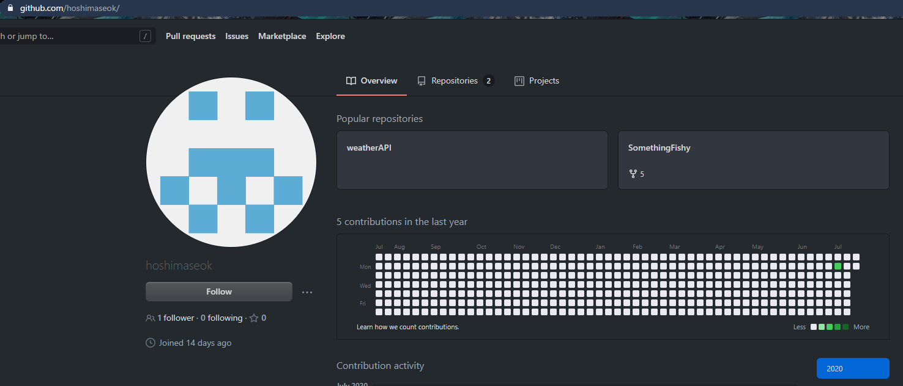
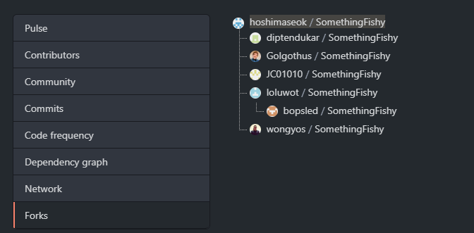
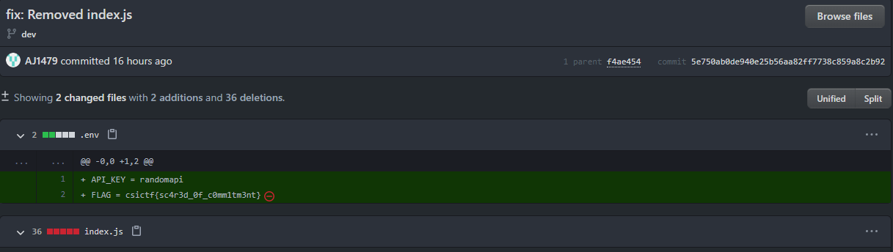
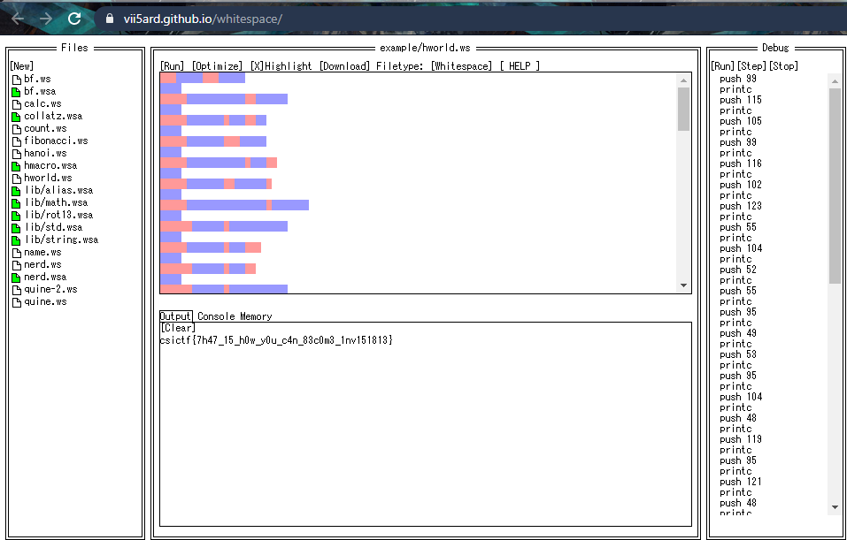

We started this CTF on Monday after the UIUCTF ended. Only had about a day to solve challenges, so I started with the highest points ones. Played with the boys from CTF.SG again, and we finished at 10th with only 4 left unsolved.

---

## OSINT

---

# Commitment

#### Category: OSINT | 50 solves | 450 points

  
Challenge Description

  
hoshimaseok is up to no good. Track him down.

Searching for the username on Google returns no results. 

However, with a search tool, I was able to find other social networks that he is registered on. 

Eventually, I found a github account here, with 2 repos.

Taking a quick look at the `SomethingFishy` repo, I have to admit that I didn't find anything fishy at first. So I went to the `weatherapi` repo and found that there was another user who committed on it, which led me to the wrong rabbit hole of doing OSINT on the wrong user.

After about 10 minutes, I gave up and returned back to the `SomethingFishy` repo. This time, I noticed that there are 5 forks. 

These bad OpSec people must have been looking for something in the repo! So I looked again and noticed that there was a `dev` branch. Going into the branch, I found that it was 32 commits ahead of master! 

And so I knew that this must be the answer. Looking through the commits one by one as there were only 32 of them, I found the flag in [this commit](https://github.com/hoshimaseok/SomethingFishy/commit/5e750ab0de940e25b56aa82ff7738c859a8c2b92?diff=unified)

Maybe these people should rethink about forking challenge repos during a live CTF next time?

  
FLAG

  
  csictf{sc4r3d_0f_c0mm1tm3nt}

***

---

## Forensics

---

# unseen

#### Category: Forensics | 66 solves | 492 points

  
Challenge Description

  
With his dying breath, Prof. Ter Stegen hands us an image and a recording. He tells us that the image is least significant, but is a numerical key to the recording and the recording hides the answer. It may seem as though it's all for nothing, but trust me it's not.
 
https://mega.nz/file/cmhnAQDB#9dbHojKcxzliZ5NAYtGBN7N8WHCqtoU7kKa5yuJzG0w 
 
https://mega.nz/file/h75UCIRJ#YGF3yCViKSQpwogmMgkdPQ1DXMez9Sv2DZBUWvCueSY

We're given a `.wav` file and an image file. 

Listening to the `morse.wav`, I decoded it to be `SEARCH-SOMEWHERE-ELSE`. I tried taking it literally as the password at first, but to no avail.

Hence I worked on the image file `nyc.png` next. Using the LSB hint from the description, I found the string `42845193` at 1-bit LSB.

Then, by using this string to decode the `morse.wav` using `steghide`, I got the file `flag.txt` which was a bunch of whitespaces, tabs and newlines. 

Plugging it into a [whitespace decoder](https://vii5ard.github.io/whitespace/) and executing the code, I got the flag!

I feel like I'm one step closer to a guess god now.

  
FLAG

  
  csictf{7h47_15_h0w_y0u_c4n_83c0m3_1nv151813}

***

