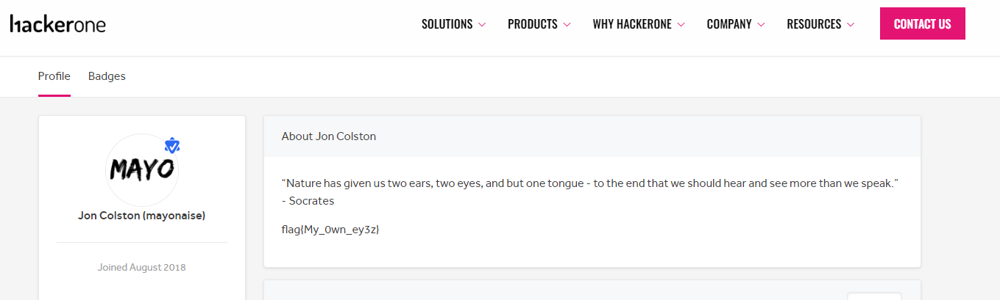

I played guess the flag with CTF.SG last week, spending a total of 3 hours to solve 20+/- of all the guess challenges. We only had a few people playing, so it wasn't surprising that we finished around top 40. 

---

## Scavenger Hunt

---

# Million Dollar Jar of Mayo

#### Category: Scavenger Hunt | 205 solves | 5 points

  
Challenge Description

  
Have you seen the million dollar jar of mayo on HackerOne?

This is obviously referring to Mayo, the well-known hacker who earned over a million USD on hackerone. 

  
FLAG

  
  flag{My_0wn_ey3z}

***

# Like and Subscribe

#### Category: Scavenger Hunt | 279 solves | 5 points

  
Challenge Description

  
There's something about liking and subscribing on YouTube!

Go to Hackerone's youtube channel about page. You don't actually have to like or subscribe.

  
FLAG

  
  flag{did_you_like_and_subscribe}

***

# The Chosen One

#### Category: Scavenger Hunt | 114 solves | 5 points

  
Challenge Description

  
NYC2017MVH

Just google for the (famous) user who attended 2017 MVH. Flag is in this profile description.

https://hackerone.com/ziot?type=user

  
FLAG

  
  flag{wh0_put_this_here}

***

# Capture the Changelog

#### Category: Scavenger Hunt | 15 solves | 5 points

  
Challenge Description

  
HackerOne.com/????????

I was the 4th solver for this. Changelog obviously refers to the policy changelog, and the question was simply which program it was. Given that this is HackerOne's official ctf, I deduced that the link was referring to `Hackerone/security`, and there was the flag.

You can see for it yourself: https://hackerone.com/security/policy_versions?type=team&change=3640655

  
FLAG

  
  flag{read_the_freaking_scope}

As someone who used to run a bug bounty in my previous company, I concur with the flag.

***