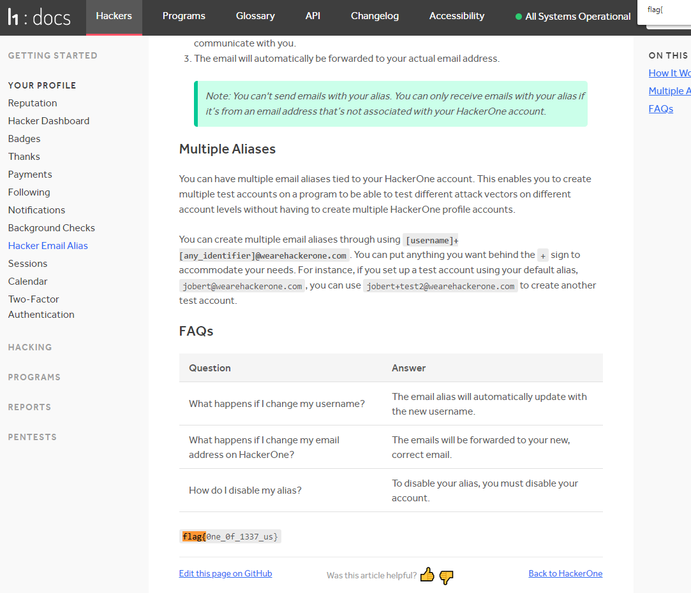
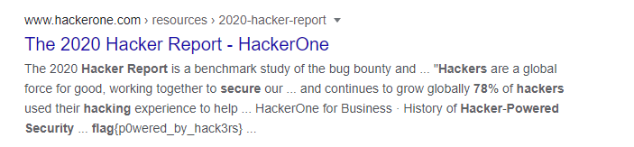
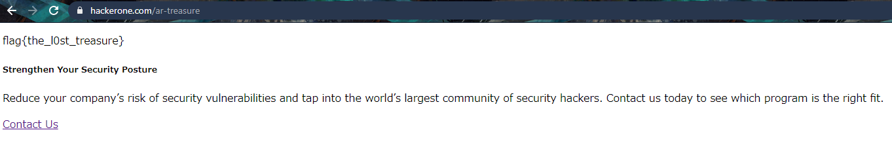

I played guess the flag with CTF.SG last week, spending a total of 3 hours to solve 20+/- of all the guess challenges. We only had a few people playing, so it wasn't surprising that we finished around top 40. 

---

## Scavenger Hunt

---

# Million Dollar Jar of Mayo

#### Category: Scavenger Hunt | 205 solves | 5 points

  
Challenge Description

  
Have you seen the million dollar jar of mayo on HackerOne?

This is obviously referring to Mayo, the well-known hacker who earned over a million USD on hackerone. 

  
FLAG

  
  flag{My_0wn_ey3z}

***

# Like and Subscribe

#### Category: Scavenger Hunt | 279 solves | 5 points

  
Challenge Description

  
There's something about liking and subscribing on YouTube!

Go to Hackerone's youtube channel about page. You don't actually have to like or subscribe.

  
FLAG

  
  flag{did_you_like_and_subscribe}

***

# One of Us

#### Category: Scavenger Hunt | 114 solves | 5 points

  
Challenge Description

  
Go back to where it all started.

Where is all started...? Hmm I still dont know where actually, but I found it on the FAQ page while crawling the H1 website.

https://docs.hackerone.com/hackers/hacker-email-alias.html#faqs

  
FLAG

  
  flag{0ne_0f_1337_us}

***

# The Streamer

#### Category: Scavenger Hunt | 278 solves | 5 points

  
Challenge Description

  
https://twitch.tv/

The streamer can only be nahamsec, so we go to twitch.tv/nahamsec and find the flag.

  
FLAG

  
  flag{kappa_kappa_kappa}

***

# The Chosen One

#### Category: Scavenger Hunt | 114 solves | 5 points

  
Challenge Description

  
NYC2017MVH

Just google for the (famous) user who attended 2017 MVH. Flag is in this profile description.

https://hackerone.com/ziot?type=user

  
FLAG

  
  flag{wh0_put_this_here}

***

# Hacker101 Discord

#### Category: Scavenger Hunt | 102 solves | 5 points

  
Challenge Description

  

Just join the discord, the flag is in #iot-village.

  
FLAG

  
  flag{IoT_village_FTW}

***

# The Social Media Influencer

#### Category: Scavenger Hunt | 151 solves | 5 points

  
Challenge Description

  

Placeholder text

  
FLAG

  
  flag{d0uble_t4p_and_follow}

***

# Security Report Powered by Hackers

#### Category: Scavenger Hunt | 40 solves | 5 points

  
Challenge Description

  
Did you know that 78% of hackers used their hacking experience to help them find or better compete for a career opportunity?

This is referring to one of the yearly reports. You'll know from the title. 

You can even see it from Google.

  
FLAG

  
  flag{p0wered_by_hack3rs}

***

# Ride Share Disclosures

#### Category: Scavenger Hunt | 99 solves | 5 points

  
Challenge Description

  
Do you even lift, though?

This is referring to the recent disclosure by Nahamsec.

https://hackerone.com/reports/885975

  
FLAG

  
  flag{plz_bounty_plz}

***

# Capture the Changelog

#### Category: Scavenger Hunt | 15 solves | 5 points

  
Challenge Description

  
HackerOne.com/????????

I was the 4th solver for this. Changelog obviously refers to the policy changelog, and the question was simply which program it was. Given that this is HackerOne's official ctf, I deduced that the link was referring to `Hackerone/security`, and there was the flag.

You can see it for yourself: https://hackerone.com/security/policy_versions?type=team&change=3640655

  
FLAG

  
  flag{read_the_freaking_scope}

As someone who used to run a bug bounty in my previous company, I concur with the flag.

***

# Lights, Camera, Hacking!

#### Category: Scavenger Hunt | 177 solves | 5 points

  
Challenge Description

  
Did you even read the video?

How do you write a video? 

The answer is of course, in the transcript. You'll find the flag in the [HackerOne video of the same name](https://www.youtube.com/watch?v=M5cDj2-1_zo).

  
FLAG

  
  flag{hackers_of_the_world}

***

# Find Me Treasure.xml

#### Category: Scavenger Hunt | 39 solves | 5 points

  
Challenge Description

  
Arr, ye dare find me treasure.xml?

This is referring to HackerOne's ARG. So just go to `hackerone.com/ar-treasure`.

  
FLAG

  
  flag{the_l0st_treasure}

***

# _config.yml#35

#### Category: Scavenger Hunt | 69 solves | 5 points

  
Challenge Description

  

Just go to `config.yml` in HackerOne's official github repo.

https://github.com/Hacker0x01/hacker101/blob/717281070979d2b32a1751643997e6411e6c0444/_config.yml#L50

Not sure why it refers to `#35` because I found it on `#50` though.

  
FLAG

  
  flag{git_sh!t_d0ne}

***

# Pentesters Unite

#### Category: Scavenger Hunt | 58 solves | 5 points

  
Challenge Description

  
  Hack2Learn

Hack to learn? Sounds like something related to the basics of pentesting:

https://raw.githubusercontent.com/Hacker0x01/hacker101/717281070979d2b32a1751643997e6411e6c0444/playlists/pentesting_basics.md

  
FLAG

  
  flag{hacker_powered_pentest}

***

# The Hacker101

#### Category: Scavenger Hunt | 144 solves | 5 points

  
Challenge Description

  
 Is this CTF working?

Placeholder text

  
FLAG

  
  flag{hack_4ll_th3_th1gs}

***

# Security@

#### Category: Scavenger Hunt | 169 solves | 5 points

  
Challenge Description

  

This refers to the upcoming event. Just view source of the page and grep `flag{`.

https://www.hackerone.com/security-at

  
FLAG

  
  flag{where_is_the_security}

***