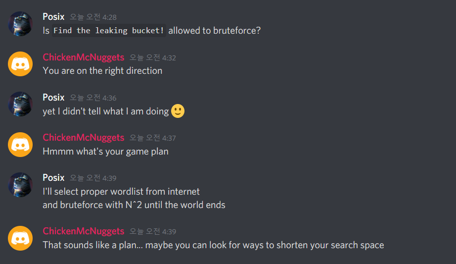
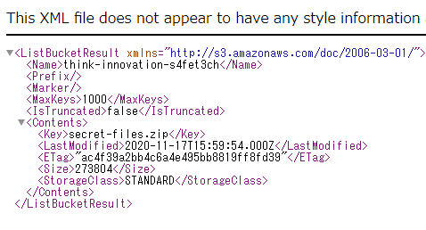
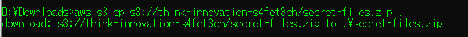
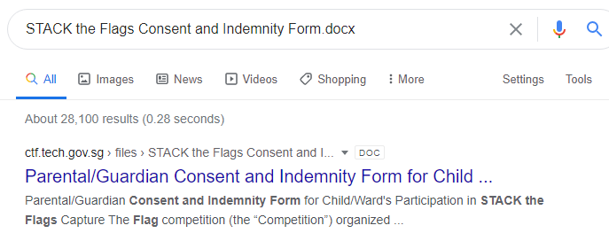
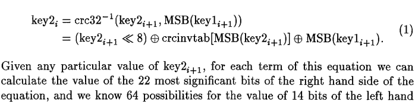
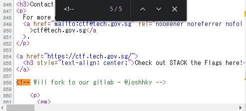
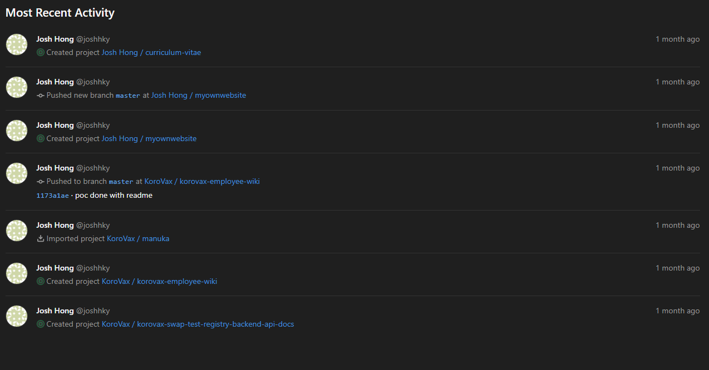
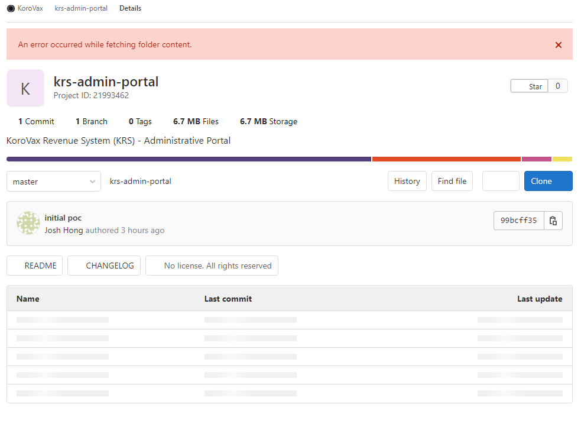
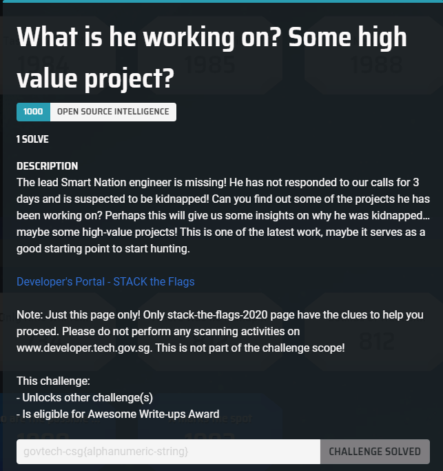

Played with some members of TFNS as Team IPhone XS and it was fun! We finished 5th. Some of the challs had too much guess in them though. Also there were a few problems like releasing hints for already solved challenges, having useless purchased hints and being inconsistent such as not releasing hints for challenges that have 0 solves on the second day.

---

## Cloud

---

# Find the leaking bucket!

#### Category: Cloud | 40 solves 

<details>
  <summary>Challenge Description</summary>
  
It was made known to us that agents of COViD are exfiltrating data to a hidden S3 bucket in AWS! We do not know the bucket name! One tip from our experienced officers is that bucket naming often uses common words related to the company’s business.<br />
<br />
Do what you can! Find that hidden S3 bucket (in the format “word1-word2-s4fet3ch”) and find out what was exfiltrated!<br />
<br />
<a href="https://d1ynvzedp0o7ys.cloudfront.net/">Company Website</a><br /><br />

<b>This part was added after we solved it:</b><br />

Please ignore these troll buckets:<br />
- s3://intelligent-intelligent-s4fet3ch/<br />
- s3://steve-jobs-s4fet4ch/<br />
- s3://mobile-cybersecurity-s4fet3ch/<br />
-----
</details>

I worked on this challenge with Posix who bruteforced the bucket name (we wasted time on troll buckets) and I did the cracking of the password protected zip.

Since the description already states that we have to find a bucket, the first thing we did was to gather keywords on the page. Just scrolling down a bit brought us to a word cloud:


<center><i>Wordcloud</i></center>

After stripping the html tags using regex from the page source, I put it into a simple python code:

```python
import subprocess

a = ['wireless','digital','parking','data','information','architecture','wifi','smartcity','computer','efficiency','technology','payment','ai','fintech','analytics','applications','internet','cybersecurity','iot','innovation','systems','knowledge','communication','mobile','intelligent']
b = a

keywords = ['-'.join((x,y)) for x in a for y in b]
f = open("links.txt",'w')
for v in keywords:
    payload = v + '-s4fet3ch'
    f.write(payload+"\n")
    f.flush()
    subprocess.call(['aws','s3','ls',payload],stdout=f)

```

This creates a list of link combinations using the keywords on the page, which brought us to http://intelligent-intelligent-s4fet3ch.s3.amazonaws.com. However all we got was `Access Denied`. After trying for 30 minutes, I decided to go ask the staff what's the deal:

```
Isopach Today at 1:05 PM
hi for Cloud Find the leaking bucket! We got the bucket intelligent-intelligent-s4fet3ch.s3.amazonaws.com but it seems that everything is private (AccesDenied)? Do we have to guess the path of flag?
also team is IPhone XS in open if needed
bbbbToday at 1:15 PM
you should keep trying to find the right bucket
```

Ah. So it wasn't the right bucket. This was before they had started the announcements for troll buckets.

So we went back to exhaust our wordlist, to no avail. None of the combinations in the present wordlist worked, and we couldn't find another seemingly relevant keyword on the page.

So Posix went to ask the staff this time, asking for permission to blindly bruteforce (as we only used the word cloud just now, it wasn't as blind). 


<center><i>Permission to Bruteforce, Sir!</i></center>

So anyways we used a good wordlist (similar to the one available in Burp) combined with the wordlist we have from the site, and eventually found the bucket to be http://think-innovation-s4fet3ch.s3.amazonaws.com. Who'd have guessed?

*PS: After the CTF, I consulted with the challenge author and found that the words in the images above and below the word cloud were intended to be used in the search.*      

The keyword `think` was actually included in the Steve Jobs quote on the page as well!

In it, there was a single file called `secret-files.zip`.


<center><i>Psst... I'm secret</i></center>

Hence we downloaded the file. If you don't know how to download from an AWS S3 bucket, there's two ways: via the CLI tool like this:


<center><i>It works on Windows too!</i></center>


Or just by appending the file to the link like this: http://think-innovation-s4fet3ch.s3.amazonaws.com/secret-files.zip 

Anyway, we quickly find out that it was password protected. At this point, Posix went to bed and I continued trying to crack it. 

First I ran `fcrackzip` on it as to not waste time, not really expecting anything out of it. Then I went to investigate the file using basic stego tools like `zipinfo` to check the type of compression etc.

There were two files in it.

```bash
───secret-files.zip
│   ├───flag.txt
│   ├───STACK the Flags Consent and Indemnity Form.docx
```

This were the contents of the zip file.

The second file seems sus, let's do a quick google search for it:


<center><i>Gotta ask Mummy</i></center>

Downloading it, the size is similar to the one in the zip archive, so we can assume that it's the same file!

If it is the same file as we had assumed, it means that we may be able to perform the [Biham and Kocher’s known plaintext attack](https://link.springer.com/chapter/10.1007/3-540-60590-8_12), whereby we use a known file compressed in the same way to crack the password.

Here is the crux of the math behind the attack:

 
<center><i>You don't actually need to understand it to utilize the tools</i></center>

So, let's spin up a docker instance and clone/make [pkcrack](https://github.com/keyunluo/pkcrack), then try to run the crack:

```bash
$ zip plain0.zip "STACK the Flags Consent and Indemnity Form.docx"
adding: STACK the Flags Consent and Indemnity Form.docx (deflated 1%)
$ /bin/pkcrack -C secret-files.zip -c "STACK the Flags Consent and Indemnity Form.docx" -P plain0.zip -p "STACK the Flags Consent and Indemnity Form.docx" -d decrypted_file.zip -a
Files read. Starting stage 1 on Sun Dec  6 05:50:31 2020
Generating 1st generation of possible key2_273321 values...done.
Found 4194304 possible key2-values.
Now we\'re trying to reduce these...
Lowest number: 997 values at offset 265129
Lowest number: 920 values at offset 265125
Lowest number: 853 values at offset 265124
Lowest number: 830 values at offset 265122
Lowest number: 804 values at offset 265121
Lowest number: 764 values at offset 265095
Lowest number: 740 values at offset 265081
Lowest number: 725 values at offset 265053
Lowest number: 675 values at offset 265052
Lowest number: 657 values at offset 265051
Lowest number: 624 values at offset 254966
Lowest number: 594 values at offset 249971
Lowest number: 555 values at offset 249879
Lowest number: 547 values at offset 249869
Lowest number: 505 values at offset 249847
Lowest number: 495 values at offset 249846
Lowest number: 491 values at offset 249832
Lowest number: 422 values at offset 249830
Lowest number: 376 values at offset 249804
Lowest number: 338 values at offset 249798
Lowest number: 335 values at offset 247693
Lowest number: 282 values at offset 247689
Lowest number: 246 values at offset 247686
Lowest number: 216 values at offset 247684
Lowest number: 202 values at offset 247672
Lowest number: 198 values at offset 247639
Lowest number: 193 values at offset 247624
Lowest number: 179 values at offset 247623
Lowest number: 163 values at offset 247621
Lowest number: 150 values at offset 247137
Lowest number: 147 values at offset 247132
Lowest number: 124 values at offset 247131
Lowest number: 119 values at offset 247130
Lowest number: 117 values at offset 247127
Lowest number: 110 values at offset 247123
Lowest number: 103 values at offset 247111
Lowest number: 101 values at offset 247098
Lowest number: 94 values at offset 247097
Done. Left with 94 possible Values. bestOffset is 247097.
Stage 1 completed. Starting stage 2 on Sun Dec  6 05:50:53 2020
Ta-daaaaa! key0=f5af793b, key1=6d3ea7ba, key2=9b71082d
Probabilistic test succeeded for 26229 bytes.
Ta-daaaaa! key0=f5af793b, key1=6d3ea7ba, key2=9b71082d
Probabilistic test succeeded for 26229 bytes.
Ta-daaaaa! key0=f5af793b, key1=6d3ea7ba, key2=9b71082d
Probabilistic test succeeded for 26229 bytes.
Stage 2 completed. Starting zipdecrypt on Sun Dec  6 05:50:53 2020
Decrypting flag.txt (1918da1aa13583f007af7db7)... OK!
Decrypting STACK the Flags Consent and Indemnity Form.docx (336ab103cd78d1b9756efc91)... OK!
Finished on Sun Dec  6 05:50:53 2020
```

And we're done! We've successfully extracted both files from the password-protected zip and can now `cat` the flag.

Doing so returns the flag below. Click on it to reveal the spoilers!

<details>
  <summary>FLAG</summary>
  
  govtech-csg{EnCrYpT!0n_D0e$_NoT_M3@n_Y0u_aR3_s4f3}
</details>

<details>
  <summary>Afterthoughts</summary>
  
  After we had solved it (probably the 8th team to do so - I can't remember clearly), the organizers put up an announcement for a list of 'troll buckets', which were probably made by other unsportsmanlike teams to confuse competitors and waste their time in finding the correct bucket. While I appreciate their kindness in telling us since there was no way to identify a correct bucket, it actually gives people who have no idea of where to start a big hint: to enumerate buckets based on words on the page. Lo and behold, as predicted, the number of solves skyrockted to 40 from single digits before. <br /><br />
  
  My feedback for improvement in this challenge was to add a trusted CA for the wildcard domain .tech.gov.sg to the target bucket and state it in the challenge description. That way, no one can spoof and people who have found it will know it is the right one, without giving any advantage to those who have not found it.<br /><br />
  
  Or perhaps simply announcing that there were unintended troll buckets around but not mentioning the names would be enough. 
</details>

---

## OSINT

---

# What is he working on? Some high value project?

#### Category: Osint | 84 solves

<details>
  <summary>Challenge Description</summary>
  
The lead Smart Nation engineer is missing! He has not responded to our calls for 3 days and is suspected to be kidnapped! Can you find out some of the projects he has been working on? Perhaps this will give us some insights on why he was kidnapped…maybe some high-value projects! This is one of the latest work, maybe it serves as a good starting point to start hunting.<br />
<br />
<b> This line was added after I solved it:</b><br />
Flag is the repository name!<br />
<br />
<a href="https://www.developer.tech.gov.sg/communities/events/stack-the-flags-2020">Developer's Portal - STACK the Flags</a><br />

<br />
Note: Just this page only! Only stack-the-flags-2020 page have the clues to help you proceed. Please do not perform any scanning activities on www.developer.tech.gov.sg. This is not part of the challenge scope!<br />
----
</details>

We are given just a page for this challenge. The first thing you want to do in any OSINT/Blind Web challenge is to open the page source, and so that's what I did. 

A quick scroll through the 1055 lines of code revealed nothing out of the ordinary, so I went for Step 2: Check the comments! 

Pressing CTRL+F on the page and entering `<!--`, which is the HTML syntax for comments, I found an interesting one on line 858: 


<center><i>What's this? Seems sus...</i></center>

Being an occasional user of Gitlab, I knew instantly that this was referring to his gitlab page, so let's navigate to https://gitlab.com/joshhky

In it, we find that his public activity began and ended 1 month ago, which cemented the idea that he must be the target we are looking for!


<center><i>Yes, Gitlab comes with a dark theme!</i></center>

We quickly find out that he belongs to the [KoroVax](https://gitlab.com/korovax) organization, something that we'll be seeing references to in other challenges too.

Browsing to the employee list as that's what stands out, I found [this piece of code](https://gitlab.com/korovax/korovax-employee-wiki/-/commit/1173a1ae90edc05618850f73f02569e657af95a1) in the commit history:
`The employee wiki will list what each employee is responsible for, eg, Josh will be in charge of the krs-admin-portal`

However, browsing to the KoroVax organization page, there seems to be no trace of the repository! And thus I retraced my steps and went back to the employee wiki [README.md page](https://gitlab.com/korovax/korovax-employee-wiki), staring at it. It stared right back at me.

And then this line hit me: `Please note that not all repository should be made public`. What if the repository had existed in the public in the past, but not now? 

Thus I went to webarchive to search for the [repository link](https://gitlab.com/korovax/krs-admin-portal), putting it in the format that it would have been *if it had existed*.

And there it was, in it's full glory. 


<center><i>KoroVax Revenue System (KRS) - Administrative Portal</i></center>

You may also access it here to see for yourself: http://web.archive.org/web/20201025064718/https://gitlab.com/korovax/krs-admin-portal

And thus we got the flag!!

...Or so I thought. After 5 minutes of trying different combinations of `krs`, `KRS`, `KoroVax_Revenue_System`, `Korovax_Revenue_System`, `korovax revenue system` and all their different capitalization forms, I decided that this was probably not the flag.

So maybe he was working on a part of the admin portal? Maybe we should do recon for more information. 

I went to call the Gitlab API for the repository:

```json
{
   "id":21993462,
   "name":"krs-admin-portal",
   "description":"KoroVax Revenue System (KRS) - Administrative Portal",
   "visibility":"public",
   "full_name":"KoroVax / krs-admin-portal",
   "created_at":"2020-10-24T13:34:33.043Z",
   "updated_at":"2020-10-25T03:35:23.156Z",
   "avatar_url":null,
   "type":"project",
   "can_edit":false,
   "edit_path":"/korovax/krs-admin-portal/edit",
   "relative_path":"/korovax/krs-admin-portal",
   "permission":null,
   "star_count":0,
   "archived":false,
   "markdown_description":"\u003cp data-sourcepos=\"1:1-1:52\" dir=\"auto\"\u003eKoroVax Revenue System (KRS) - Administrative Portal\u003c/p\u003e",
   "marked_for_deletion":false
}
]
```

Which, wasn't very useful as it didn't bring any new information. Then I thought - maybe I need to get Josh's login credentials or API on Gitlab, and proceeded to waste another 30 minutes looking for those information, until I eventually gave up and opened a support ticket to ask the admin.

It turned out to be just the repository name. 

I actually first blooded this challenge despite wasting so much time on it. 


<center><i>first-blood.mp3</i></center>

As usual, click below to see the flag. 

<details>
  <summary>FLAG</summary>
  
  govtech-csg{krs-admin-portal}
</details>

<details>
  <summary>Afterthoughts</summary>
  
  After I solved it, there were also a few teams who did as well. However, the organizers still decided to release a big hint on the next day: `Flag is the repository name!` and the number of solves skyrocketed to over half of the participating teams. Saying it is the repository name means it can be only github, gitlab or bitbucket (in most cases), and since the source page has a gitlab reference, it basically it the same as telling you to "find a gitlab repo that our target has participated in", and thus the result. <br />
  <br />
  If any of you ever organize a CTF, never ever release a hint for a challenge that has > 0 solves.<br /> 
  <br />
  Anyway I digress. On to the next challenge!
</details>


***

# Only time will tell!

#### Category: Osint | 81 solves 

<details>
  <summary>Challenge Description</summary>
  
This picture was taken sent to us! It seems like a bomb threat! Are you able to tell where and when this photo was taken? This will help the investigating officers to narrow down their search! All we can tell is that it's taken during the day!<br /><br />

If you think that it's 7.24pm in which the photo was taken. Please take the associated 2 hour block. This will be 1900-2100. If you think it is 10.11am, it will be 1000-1200.<br /><br />

Flag Example: govtech-csg{1.401146_103.927020_1990:12:30_2000-2200}<br />
Use this <a href="https://www.pgc.umn.edu/apps/convert/">calculator</a>!<br />

Please view this <a href="https://docs.google.com/document/d/11jHOoruVosCRLQzgtZv3iC8cRVJXoML8spfa8FWSfZY/edit?usp=sharing">Document</a> for download instructions.<br /><br />

Flag Format: govtech-csg{lat_long_date_[two hour block format]}<br /><br />

<b>This part was added after I solved it:</b><br />

Addendum:<br />
- The amount of decimal places required is the same as shown in the example given.<br />
- CLI tool to get something before you convert it with the calculator.<br />
----
</details>

Placeholder


<details>
  <summary>FLAG</summary>
  
  govtech-csg{1.286647_103.846836_2020:10:25_1500-1700}
</details>

<details>
  <summary>Afterthoughts</summary>
  
  Again, the organizers decided to release a hint 22 hours into the CTF, after this challenge had about 10-20 solves. The number of solves skyrocketed to 81 after that. I'm not even angry anymore, just disappointed. My role this CTF was to score as many points as possible in the OSINT/For/Misc categories since we had a web god on our side, but it seems that with each hint being released, my efforts were worth less and lesser.
</details>

***