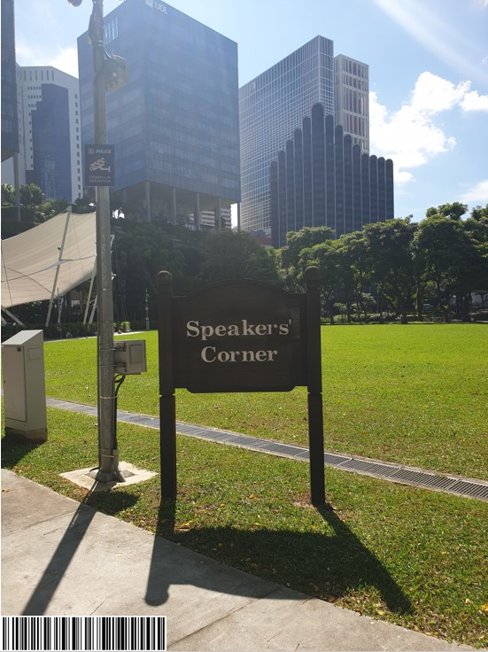
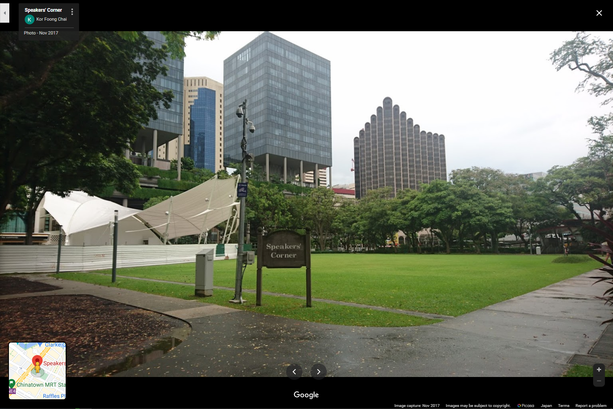
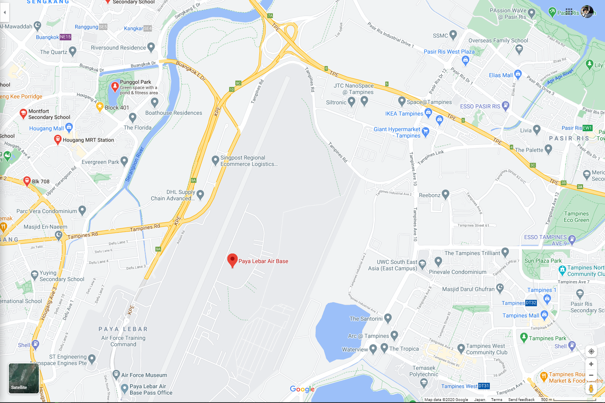
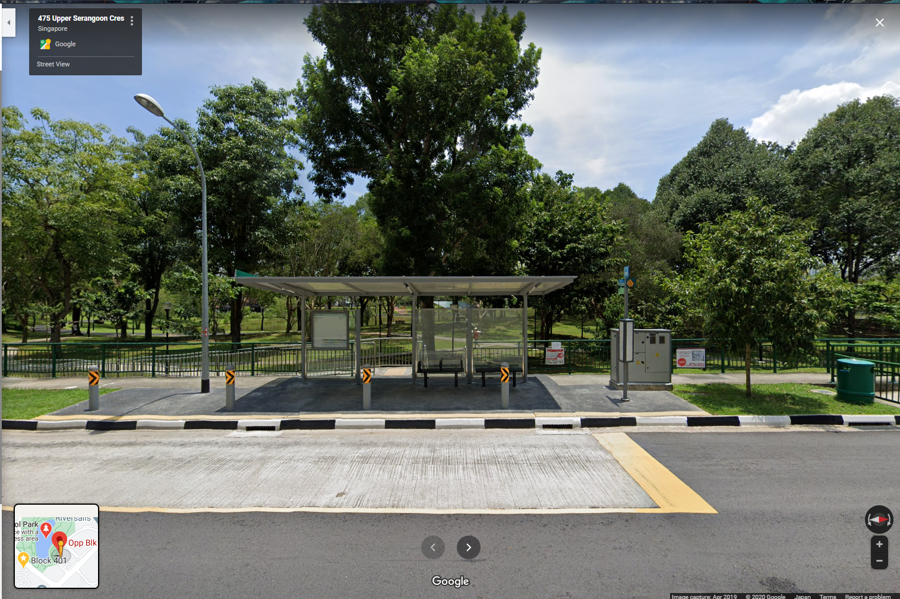

Played with some members of TFNS as Team IPhone XS and it was fun! We finished 5th. Some of the challs had too much guess in them though. Also there were a few problems like releasing hints for already solved challenges, having useless purchased hints and being inconsistent such as not releasing hints for challenges that have 0 solves on the second day.

---

## Cloud

---

# Find the leaking bucket!

#### Category: Cloud | 40 solves 

<details>
  <summary>Challenge Description</summary>
  
It was made known to us that agents of COViD are exfiltrating data to a hidden S3 bucket in AWS! We do not know the bucket name! One tip from our experienced officers is that bucket naming often uses common words related to the company’s business.<br />
<br />
Do what you can! Find that hidden S3 bucket (in the format “word1-word2-s4fet3ch”) and find out what was exfiltrated!<br />
<br />
<a href="https://d1ynvzedp0o7ys.cloudfront.net/">Company Website</a><br /><br />

<b>This part was added after we solved it:</b><br />

Please ignore these troll buckets:<br />
- s3://intelligent-intelligent-s4fet3ch/<br />
- s3://steve-jobs-s4fet4ch/<br />
- s3://mobile-cybersecurity-s4fet3ch/<br />
-----
</details>

I worked on this challenge with Posix who bruteforced the bucket name (we wasted time on troll buckets) and I did the cracking of the password protected zip.

Since the description already states that we have to find a bucket, the first thing we did was to gather keywords on the page. Just scrolling down a bit brought us to a word cloud:


<center><i>Wordcloud</i></center>

After stripping the html tags using regex from the page source, I put it into a simple python code:

```python
import subprocess

a = ['wireless','digital','parking','data','information','architecture','wifi','smartcity','computer','efficiency','technology','payment','ai','fintech','analytics','applications','internet','cybersecurity','iot','innovation','systems','knowledge','communication','mobile','intelligent']
b = a

keywords = ['-'.join((x,y)) for x in a for y in b]
f = open("links.txt",'w')
for v in keywords:
    payload = v + '-s4fet3ch'
    f.write(payload+"\n")
    f.flush()
    subprocess.call(['aws','s3','ls',payload],stdout=f)

```

This creates a list of link combinations using the keywords on the page, which brought us to http://intelligent-intelligent-s4fet3ch.s3.amazonaws.com. However all we got was `Access Denied`. After trying for 30 minutes, I decided to go ask the staff what's the deal:

```
Isopach Today at 1:05 PM
hi for Cloud Find the leaking bucket! We got the bucket intelligent-intelligent-s4fet3ch.s3.amazonaws.com but it seems that everything is private (AccesDenied)? Do we have to guess the path of flag?
also team is IPhone XS in open if needed
bbbbToday at 1:15 PM
you should keep trying to find the right bucket
```

Ah. So it wasn't the right bucket. This was before they had started the announcements for troll buckets.

So we went back to exhaust our wordlist, to no avail. None of the combinations in the present wordlist worked, and we couldn't find another seemingly relevant keyword on the page.

So Posix went to ask the staff this time, asking for permission to blindly bruteforce (as we only used the word cloud just now, it wasn't as blind). 


<center><i>Permission to Bruteforce, Sir!</i></center>

So anyways we used a good wordlist (similar to the one available in Burp) combined with the wordlist we have from the site, and eventually found the bucket to be http://think-innovation-s4fet3ch.s3.amazonaws.com. Who'd have guessed?

*PS: After the CTF, I consulted with the challenge author and found that the words in the images above and below the word cloud were intended to be used in the search.*      

The keyword `think` was actually included in the Steve Jobs quote on the page as well!

In it, there was a single file called `secret-files.zip`.


<center><i>Psst... I'm secret</i></center>

Hence we downloaded the file. If you don't know how to download from an AWS S3 bucket, there's two ways: via the CLI tool like this:


<center><i>It works on Windows too!</i></center>


Or just by appending the file to the link like this: http://think-innovation-s4fet3ch.s3.amazonaws.com/secret-files.zip 

Anyway, we quickly find out that it was password protected. At this point, Posix went to bed and I continued trying to crack it. 

First I ran `fcrackzip` on it as to not waste time, not really expecting anything out of it. Then I went to investigate the file using basic stego tools like `zipinfo` to check the type of compression etc.

There were two files in it.

```bash
───secret-files.zip
│   ├───flag.txt
│   ├───STACK the Flags Consent and Indemnity Form.docx
```

This were the contents of the zip file.

The second file seems sus, let's do a quick google search for it:


<center><i>Gotta ask Mummy</i></center>

Downloading it, the size is similar to the one in the zip archive, so we can assume that it's the same file!

If it is the same file as we had assumed, it means that we may be able to perform the [Biham and Kocher’s known plaintext attack](https://link.springer.com/chapter/10.1007/3-540-60590-8_12), whereby we use a known file compressed in the same way to crack the password.

Here is the crux of the math behind the attack:

 
<center><i>You don't actually need to understand it to utilize the tools</i></center>

So, let's spin up a docker instance and clone/make [pkcrack](https://github.com/keyunluo/pkcrack), then try to run the crack:

```bash
$ zip plain0.zip "STACK the Flags Consent and Indemnity Form.docx"
adding: STACK the Flags Consent and Indemnity Form.docx (deflated 1%)
$ /bin/pkcrack -C secret-files.zip -c "STACK the Flags Consent and Indemnity Form.docx" -P plain0.zip -p "STACK the Flags Consent and Indemnity Form.docx" -d decrypted_file.zip -a
Files read. Starting stage 1 on Sun Dec  6 05:50:31 2020
Generating 1st generation of possible key2_273321 values...done.
Found 4194304 possible key2-values.
Now we\'re trying to reduce these...
Lowest number: 997 values at offset 265129
Lowest number: 920 values at offset 265125
Lowest number: 853 values at offset 265124
Lowest number: 830 values at offset 265122
Lowest number: 804 values at offset 265121
Lowest number: 764 values at offset 265095
Lowest number: 740 values at offset 265081
Lowest number: 725 values at offset 265053
Lowest number: 675 values at offset 265052
Lowest number: 657 values at offset 265051
Lowest number: 624 values at offset 254966
Lowest number: 594 values at offset 249971
Lowest number: 555 values at offset 249879
Lowest number: 547 values at offset 249869
Lowest number: 505 values at offset 249847
Lowest number: 495 values at offset 249846
Lowest number: 491 values at offset 249832
Lowest number: 422 values at offset 249830
Lowest number: 376 values at offset 249804
Lowest number: 338 values at offset 249798
Lowest number: 335 values at offset 247693
Lowest number: 282 values at offset 247689
Lowest number: 246 values at offset 247686
Lowest number: 216 values at offset 247684
Lowest number: 202 values at offset 247672
Lowest number: 198 values at offset 247639
Lowest number: 193 values at offset 247624
Lowest number: 179 values at offset 247623
Lowest number: 163 values at offset 247621
Lowest number: 150 values at offset 247137
Lowest number: 147 values at offset 247132
Lowest number: 124 values at offset 247131
Lowest number: 119 values at offset 247130
Lowest number: 117 values at offset 247127
Lowest number: 110 values at offset 247123
Lowest number: 103 values at offset 247111
Lowest number: 101 values at offset 247098
Lowest number: 94 values at offset 247097
Done. Left with 94 possible Values. bestOffset is 247097.
Stage 1 completed. Starting stage 2 on Sun Dec  6 05:50:53 2020
Ta-daaaaa! key0=f5af793b, key1=6d3ea7ba, key2=9b71082d
Probabilistic test succeeded for 26229 bytes.
Ta-daaaaa! key0=f5af793b, key1=6d3ea7ba, key2=9b71082d
Probabilistic test succeeded for 26229 bytes.
Ta-daaaaa! key0=f5af793b, key1=6d3ea7ba, key2=9b71082d
Probabilistic test succeeded for 26229 bytes.
Stage 2 completed. Starting zipdecrypt on Sun Dec  6 05:50:53 2020
Decrypting flag.txt (1918da1aa13583f007af7db7)... OK!
Decrypting STACK the Flags Consent and Indemnity Form.docx (336ab103cd78d1b9756efc91)... OK!
Finished on Sun Dec  6 05:50:53 2020
```

And we're done! We've successfully extracted both files from the password-protected zip and can now `cat` the flag.

Doing so returns the flag below. Click on it to reveal the spoilers!

<details>
  <summary>FLAG</summary>
  
  govtech-csg{EnCrYpT!0n_D0e$_NoT_M3@n_Y0u_aR3_s4f3}
</details>

<details>
  <summary>Afterthoughts</summary>
  
  After we had solved it (probably the 8th team to do so - I can't remember clearly), the organizers put up an announcement for a list of 'troll buckets', which were probably made by other unsportsmanlike teams to confuse competitors and waste their time in finding the correct bucket. While I appreciate their kindness in telling us since there was no way to identify a correct bucket, it actually gives people who have no idea of where to start a big hint: to enumerate buckets based on words on the page. Lo and behold, as predicted, the number of solves skyrockted to 40 from single digits before. <br /><br />
  
  My feedback for improvement in this challenge was to add a trusted CA for the wildcard domain .tech.gov.sg to the target bucket and state it in the challenge description. That way, no one can spoof and people who have found it will know it is the right one, without giving any advantage to those who have not found it.<br /><br />
  
  Or perhaps simply announcing that there were unintended troll buckets around but not mentioning the names would be enough. 
</details>

---

## OSINT

---

# What is he working on? Some high value project?

#### Category: Osint | 84 solves

<details>
  <summary>Challenge Description</summary>
  
The lead Smart Nation engineer is missing! He has not responded to our calls for 3 days and is suspected to be kidnapped! Can you find out some of the projects he has been working on? Perhaps this will give us some insights on why he was kidnapped…maybe some high-value projects! This is one of the latest work, maybe it serves as a good starting point to start hunting.<br />
<br />
<b> This line was added after I solved it:</b><br />
Flag is the repository name!<br />
<br />
<a href="https://www.developer.tech.gov.sg/communities/events/stack-the-flags-2020">Developer's Portal - STACK the Flags</a><br />

<br />
Note: Just this page only! Only stack-the-flags-2020 page have the clues to help you proceed. Please do not perform any scanning activities on www.developer.tech.gov.sg. This is not part of the challenge scope!<br />
----
</details>

We are given just a page for this challenge. The first thing you want to do in any OSINT/Blind Web challenge is to open the page source, and so that's what I did. 

A quick scroll through the 1055 lines of code revealed nothing out of the ordinary, so I went for Step 2: Check the comments! 

Pressing CTRL+F on the page and entering `<!--`, which is the HTML syntax for comments, I found an interesting one on line 858: 


<center><i>What's this? Seems sus...</i></center>

Being an occasional user of Gitlab, I knew instantly that this was referring to his gitlab page, so let's navigate to https://gitlab.com/joshhky

In it, we find that his public activity began and ended 1 month ago, which cemented the idea that he must be the target we are looking for!


<center><i>Yes, Gitlab comes with a dark theme!</i></center>

We quickly find out that he belongs to the [KoroVax](https://gitlab.com/korovax) organization, something that we'll be seeing references to in other challenges too.

Browsing to the employee list as that's what stands out, I found [this piece of code](https://gitlab.com/korovax/korovax-employee-wiki/-/commit/1173a1ae90edc05618850f73f02569e657af95a1) in the commit history:
`The employee wiki will list what each employee is responsible for, eg, Josh will be in charge of the krs-admin-portal`

However, browsing to the KoroVax organization page, there seems to be no trace of the repository! And thus I retraced my steps and went back to the employee wiki [README.md page](https://gitlab.com/korovax/korovax-employee-wiki), staring at it. It stared right back at me.

And then this line hit me: `Please note that not all repository should be made public`. What if the repository had existed in the public in the past, but not now? 

Thus I went to webarchive to search for the [repository link](https://gitlab.com/korovax/krs-admin-portal), putting it in the format that it would have been *if it had existed*.

And there it was, in it's full glory. 


<center><i>KoroVax Revenue System (KRS) - Administrative Portal</i></center>

You may also access it here to see for yourself: http://web.archive.org/web/20201025064718/https://gitlab.com/korovax/krs-admin-portal

And thus we got the flag!!

...Or so I thought. After 5 minutes of trying different combinations of `krs`, `KRS`, `KoroVax_Revenue_System`, `Korovax_Revenue_System`, `korovax revenue system` and all their different capitalization forms, I decided that this was probably not the flag.

So maybe he was working on a part of the admin portal? Maybe we should do recon for more information. 

I went to call the Gitlab API for the repository:

```json
{
   "id":21993462,
   "name":"krs-admin-portal",
   "description":"KoroVax Revenue System (KRS) - Administrative Portal",
   "visibility":"public",
   "full_name":"KoroVax / krs-admin-portal",
   "created_at":"2020-10-24T13:34:33.043Z",
   "updated_at":"2020-10-25T03:35:23.156Z",
   "avatar_url":null,
   "type":"project",
   "can_edit":false,
   "edit_path":"/korovax/krs-admin-portal/edit",
   "relative_path":"/korovax/krs-admin-portal",
   "permission":null,
   "star_count":0,
   "archived":false,
   "markdown_description":"\u003cp data-sourcepos=\"1:1-1:52\" dir=\"auto\"\u003eKoroVax Revenue System (KRS) - Administrative Portal\u003c/p\u003e",
   "marked_for_deletion":false
}
]
```

Which, wasn't very useful as it didn't bring any new information. Then I thought - maybe I need to get Josh's login credentials or API on Gitlab, and proceeded to waste another 30 minutes looking for those information, until I eventually gave up and opened a support ticket to ask the admin.

It turned out to be just the repository name. 

I actually first blooded this challenge despite wasting so much time on it. 


<center><i>first-blood.mp3</i></center>

As usual, click below to see the flag. 

<details>
  <summary>FLAG</summary>
  
  govtech-csg{krs-admin-portal}
</details>

<details>
  <summary>Afterthoughts</summary>
  
  After I solved it, there were also a few teams who did as well. However, the organizers still decided to release a big hint on the next day: `Flag is the repository name!` and the number of solves skyrocketed to over half of the participating teams. Saying it is the repository name means it can be only github, gitlab or bitbucket (in most cases), and since the source page has a gitlab reference, it basically it the same as telling you to "find a gitlab repo that our target has participated in", and thus the result. <br />
  <br />
  If any of you ever organize a CTF, never ever release a hint for a challenge that has > 0 solves.<br /> 
  <br />
  Anyway I digress. On to the next challenge!
</details>


***

# Only time will tell!

#### Category: Osint | 81 solves 

<details>
  <summary>Challenge Description</summary>
  
This picture was taken sent to us! It seems like a bomb threat! Are you able to tell where and when this photo was taken? This will help the investigating officers to narrow down their search! All we can tell is that it's taken during the day!<br /><br />

If you think that it's 7.24pm in which the photo was taken. Please take the associated 2 hour block. This will be 1900-2100. If you think it is 10.11am, it will be 1000-1200.<br /><br />

Flag Example: govtech-csg{1.401146_103.927020_1990:12:30_2000-2200}<br />
Use this <a href="https://www.pgc.umn.edu/apps/convert/">calculator</a>!<br />

Please view this <a href="https://docs.google.com/document/d/11jHOoruVosCRLQzgtZv3iC8cRVJXoML8spfa8FWSfZY/edit?usp=sharing">Document</a> for download instructions.<br /><br />

Flag Format: govtech-csg{lat_long_date_[two hour block format]}<br /><br />

<b>This part was added after I solved it:</b><br />

Addendum:<br />
- The amount of decimal places required is the same as shown in the example given.<br />
- CLI tool to get something before you convert it with the calculator.<br />
----
</details>

We're given a picture for this one. To be precise, a *photo*.


<center><i>Speaker's Corner</i></center> 

This is the same photo in the files, with EXIF all intact.

Now, the first thing we want to do when we get any photo in a Forensics/Osint/Misc challenge is to take a look at its properties using [ExifTool](https://exiftool.org/).

```bash
exiftool.exe "osint-challenge-6.jpg"
ExifTool Version Number         : 12.12
File Name                       : osint-challenge-6.jpg
Directory                       : .
File Size                       : 123 KiB
File Modification Date/Time     : 2020:12:01 10:52:40+09:00
File Access Date/Time           : 2020:12:11 07:06:29+09:00
File Creation Date/Time         : 2020:12:05 01:00:27+09:00
File Permissions                : rw-rw-rw-
File Type                       : JPEG
File Type Extension             : jpg
MIME Type                       : image/jpeg
JFIF Version                    : 1.01
X Resolution                    : 96
Y Resolution                    : 96
Exif Byte Order                 : Big-endian (Motorola, MM)
Make                            : COViD
Resolution Unit                 : inches
Y Cb Cr Positioning             : Centered
GPS Latitude Ref                : North
GPS Longitude Ref               : East
Image Width                     : 551
Image Height                    : 736
Encoding Process                : Baseline DCT, Huffman coding
Bits Per Sample                 : 8
Color Components                : 3
Y Cb Cr Sub Sampling            : YCbCr4:2:0 (2 2)
Image Size                      : 551x736
Megapixels                      : 0.406
GPS Latitude                    : 1 deg 17' 11.93" N
GPS Longitude                   : 103 deg 50' 48.61" E
GPS Position                    : 1 deg 17' 11.93" N, 103 deg 50' 48.61" E
```

From the results, the most interesting information we can glean from is the GPS Coordinates, given that the challenge description references a [GPS coordinate conversion tool](https://www.pgc.umn.edu/apps/convert/). Putting our Latitude and Longitude values into the converter, we get the `lat_lon` as `1.286647_103.846836`, which makes up the first part of the flag!

The second part requires some date in `YYYY:MM:DD` format, but where can we get that? From the ExifTool, it seems that it is likely to be `2020:12:01` as that was the earliest time the file was modified. If we were to take that as face value, it would also mean that the time this photo was taken was at 10:52 AM.

But something felt off. Looking at the shadow and considering that the Sun rises in the East and sets in the West, it is clearly at some point past noon as its [location on Google Maps](https://goo.gl/maps/F3ASxaGgNQAsnDS39) - not the same coordinates, but taken from the same angle - is facing towards the West. Having never been there in person in my life, I was 99% certain that this was the correct location even though the GPS coordinates differed by the last decimal point. 


<center><i>Same angle, but further</i></center> 

Thus, we can write off the date/time given in the EXIF of that photo as fake. As there were limited tries for submitting the flag (at first, then they removed it for everyone after a few solves...), it ~~is~~ was very important that we get it on the first try.

Let's take another look at the photo again to look for clues. Speaking of which, *what's that barcode doing down there?*


<center><i>Suspicious barcode</i></center> 

Reading the barcode on my phone's barcode/qr code scanner yielded no results, probably because it was looking for a link. Googling for an online barcode reader, I found [this](https://online-barcode-reader.inliteresearch.com/), which read and interpreted the barcode as `25 October 2020`. 

We've got the date! I am much more inclined to believe that this is the correct date than the apparent red herring that was in the File Modification Date, as this information is purposefully shown to us as compared to the other one.

Hence we have the second part of the flag now, making it `1.286647_103.846836_2020:10:25_`. We just need to find the time.

As said earlier, the time must be in the afternoon, and must be after noon. Given that we ~~have~~ had only 3 tries, we can probably bruteforce it within 3 tries in the 'afternoon' time range. 

Hence I started with `1300-1500`, because it cannot include the noon hour given the shadow. It was wrong.    
Then I tried `1400-1600`. Wrong.

Finally, I tried `1500-1700`, and I got the flag! 


<details>
  <summary>FLAG</summary>
  
  govtech-csg{1.286647_103.846836_2020:10:25_1500-1700}
</details>

<details>
  <summary>Afterthoughts</summary>
  
  Again, the organizers decided to release a hint 22 hours into the CTF, after this challenge had about 10-20 solves. The number of solves skyrocketed to 81 after that. I'm not even angry anymore, just disappointed. My role this CTF was to score as many points as possible in the OSINT/For/Misc categories since we had a web god on our side, but it seems that with each hint being released, my efforts were worth less and lesser...
</details>

***

# Where was he kidnapped?

#### Category: Osint | 71 solves 

<details>
  <summary>Challenge Description</summary>
  
The missing engineer stores his videos from his phone in his private cloud servers. We managed to get hold of these videos and we will need your help to trace back the route taken he took before going missing and identify where he was potentially kidnapped!<br /><br />

You only have limited number of flag submissions!<br /><br />

Please view this <a href="https://docs.google.com/document/d/11jHOoruVosCRLQzgtZv3iC8cRVJXoML8spfa8FWSfZY/edit?usp=sharing">Document</a> for download instructions.<br /><br />

Flag Format: govtech-csg{postal_code}<br />
----
</details>

In this challenge, we're given 3 video files. I've converted them to `.webm` for your viewing pleasure.

The first one features our presumed to-be-victim is waiting for a bus which had taken a long time to come.

<center><video src="../assets/stack-the-flags-2020/video-1.webm" type="video/webm" width="320" height="200" controls preload></video></center>
<center><i>Video 1 - Bus</i></center>

The second one features him heading to somewhere after getting off the bus, with the caption hinting that this place is very far from any train stations.

<center><video src="../assets/stack-the-flags-2020/video-2.webm" type="video/webm" width="320" height="200" controls preload></video></center>
<center><i>Video 2 - Heading somewhere</i></center>

And the third one features him waiting at a void deck, before he is suddenly assaulted from behind. *I hope his phone is okay.*

<center><video src="../assets/stack-the-flags-2020/video-3.webm" type="video/webm" width="320" height="200" controls preload></video></center>
<center><i>Video 3 - Void Deck</i></center>

Piecing this together, it seems that we have to follow some bus route until the point he gets off the bus and find the exact block of HDB flats he entered, of which's postal code should be our flag.

Looking at the first video, the bus number is `117` and it is headed towards `Punggol Int`. We have to first find where this bus stop is, as I have no clue, having never lived in that area nor been there in the past decade.

A quick Google search brings us the [bus route](https://www.transitlink.com.sg/eservice/eguide/service_route.php?service=117), which we will be using a lot.

Since the direction is towards Punggol Int, we want to look at the table on the right. Seeing as it could be anywhere but the start and the terminus, I started with analyzing the block from `Yishun Ave 2`, planning to go up and down if I couldn't find any leads.

```
Yishun Ave 2
2.7	 59529	 • Opp Yishun Emerald
3.1	 59259	 • Darul Makmur Mque
3.6	 59099	 • Blk 220
4.1	 59073	 • Opp Yishun Stn
4.3	 59069	 • Opp Blk 757
5.0	 59059	 • Blk 608
5.5	 59049	 • Opp Khatib Stn
5.9	 59039	 • Yishun Sports Hall
```

Hence this will be our first goal: Find the bus stop!

Going by curvature of road that the bus comes in at 0:00:01, I determined the following:

```
Not 59529 Opp Yishun Emerald (road curvature)
Not 59259 Darul Makmur Mque (no yellow line)
Not 59099 Blk 220 (no yellow line)
```

Which resulted in me quickly finding out that he boarded the bus at `59073 Opp Yishun Stn`, as the road curvature and yellow line matches. A quick look on the opposite side of the road also showed that the structure of the building opposite matches, as well as the residential HDB blocks towards the far left. You can see it for yourself [here](https://www.google.com/maps/place/Opp+Yishun+Stn/@1.4286988,103.8353997,3a,75y,7h,79.69t/data=!3m7!1e1!3m5!1sW9sSj2PK228FcI3NhpPlvw!2e0!6s%2F%2Fgeo3.ggpht.com%2Fcbk%3Fpanoid%3DW9sSj2PK228FcI3NhpPlvw%26output%3Dthumbnail%26cb_client%3Dmaps_sv.tactile.gps%26thumb%3D2%26w%3D203%26h%3D100%26yaw%3D272.8307%26pitch%3D0%26thumbfov%3D100!7i16384!8i8192!4m7!3m6!1s0x31da146fa2ae5aa1:0xc083032b27216e52!8m2!3d1.428681!4d103.835472!14m1!1BCgIgARICCAI).

I then used the same method to attempt to find the bus stop he alighted at, to no avail. If you want to see my failures, click on the spoiler tag below.

 <details>
  <summary>Epic Fail</summary>
  
  Remaining bus stops:<br /><br />
  
  
  <s>4.3	 59069	 • Opp Blk 757</s><br />
  <s>5.0	 59059	 • Blk 608</s> (Pillars are white) <br />
  <s>5.5	 59049	 • Opp Khatib Stn</s> (near station) <br />
  <s>5.9	 59039	 • Yishun Sports Hall</s> (blocks 5min walk wrong pillars) <br />
      	Yishun Ave 1<br />
  <s>6.7	 59721	 • Blk 816</s> (white pillars, no walkway) <br />
  <s>7.2	 59501	 • Blk 871</s> (white pillars, no walkway)<br />
  <s>7.6	 59731	 • Blk 512A</s> (white pillars)<br />
  <s>8.0	 59741	 • Opp Orchid Country Club</s> (white)<br />
  <s>8.3	 59751	 • Opp The Shaughnessy</s> (white)<br />
  <s>8.8	 59471	 • Blk 430B</s> (pillar wrong pattern)<br />
  <s>9.1	 59781	 • Bef Blk 469B</s> (blocks 5min walk+) (no similar blocks nearby)<br />
  <s>9.2	 59771	 • Blk 469B</s> (Green pillars)<br />
  <s>9.8	 68179	 • Aft Yishun Ave 8</s> (blocks 10+ min away)<br />
      	West Camp Rd<br />
  <s>11.5	 68159	 • Aft Shell Aviation</s> (not residential skip)<br />
  <s>12.1	 68149	 • ST Aerospace</s> (not residential skip)<br />
  <s>12.4	 68139	 • Youth Flying Club</s> (not residential skip)<br />
  <s>13.2	 68169	 • Bef Seletar A'space Lane</s> (not residential)<br />
      	Seletar A'space Dr<br />
  <s>13.7	 68129	 • Aft West Camp Rd</s> (no blocks nearby)<br />
  <s>14.1	 68109	 • Opp Rolls Royce Pte Ltd</s> (no blocks nearby)<br />
  <s>14.5	 68089	 • Aft Seletar A'space Rise</s> (no residential blocks nearby)<br />
  <s>14.8	 68099	 • Bef Baker St</s> (No HDB blocks)<br />
      	Piccadilly<br />
  <s>15.4	 68069	 • Opp Sing-China Bldg</s> (No void deck)<br />
      	Jln Kayu<br />
  <s>16.0	 68119	 • Aft Seletar Camp G</s> (No HDB)<br />
      	Punggol Way<br />
  <s>18.8	 65439	 • Aft TPE</s> (Couldnt find similar block )<br />
  <s>19.2	 65149	 • Soo Teck Stn</s> (literally station, no similar blocks)<br />
      	Punggol Ctrl<br />
  <s>19.5	 65401	 • Opp Blk 264A</s> (near station, no similar block)<br />
     	Punggol Pl<br />
  <s>20.2	 65009	 • Punggol Temp Int</s> (station)<br />

</details>

However, in doing this, I drew up a very detailed list of requirements the bus stop must meet:

- Not near any station
- (Maybe) near a HDB flat entrance
- Yellow pillars at entrance and black circular pillars after
- Bench near walkway entrance, seems like many benches.
- Bench style at void deck is criss-cross with bump in center. Seems the same as the one in the walkway (should be the same logically)

And thus I began my second round of searching, this time using Google Maps -> Search for Start Point `Sembawang Int` and End Point `Punggol Int` -> Choose Bus 117 only route -> Follow the route using Street View.

In doing so, after just 10 minutes I found the [target flat](https://www.google.com/maps/@1.412745,103.8377924,3a,75y,33.84h,91.59t/am=t/data=!3m6!1e1!3m4!1swMQlBO6IxGYLnPuiC-W8uQ!2e0!7i16384!8i8192?hl=en)!


<center><i>Video 2 Location</i></center> 

Just look at it. It's the exact same place as the one in the video. Exiting Street View and looking at the location, I found that it was [Blk 870](https://goo.gl/maps/3Zo5kce1VuLreMUq9), and the postal code as shown on Google Maps is 760870.

Wrap that in the flag format, and we've solved it.

<details>
  <summary>FLAG</summary>
  
  govtech-csg{760870}
</details>

<details>
  <summary>Afterthoughts</summary>
  
  I learnt that before you start searching, you should think in terms of what the challenge author is thinking. It was only after I solved it that I realised that s/he probably intended for us to solve it by following the route on Street View, as it's a common technique in OSINT challenges.
</details>

***

# Sounds of freedom!

#### Category: Osint | 71 solves 

<details>
  <summary>Challenge Description</summary>
  
In a recent raid on a suspected COViD hideout, we found this video in a thumbdrive on-site. We are not sure what this video signifies but we suspect COViD's henchmen might be surveying a potential target site for a biological bomb. We believe that the attack may happen soon. We need your help to identify the water body in this video! This will be a starting point for us to do an area sweep of the vicinity!<br /><br />

Please view this <a href="https://docs.google.com/document/d/11jHOoruVosCRLQzgtZv3iC8cRVJXoML8spfa8FWSfZY/edit?usp=sharing">Document</a> for download instructions.<br /><br />

Flag Format: govtech-csg{postal_code}<br />
----
</details>

For this challenge we are given a single video, 12.4 seconds long. We only have 3 attempts at max.

<center><video src="../assets/stack-the-flags-2020/sounds-of-freedom.webm" type="video/webm" width="320" height="200" controls preload></video></center>
<center><i>Sounds? What sounds?</i></center>

I honestly didn't hear any sound besides the wind. I guess it wasn't meant to be some clue.

Looking at the video, we see at the highest point there's a water body of some sort, along with HDB flats behind it. So the water body is probably not that big, but we can't be sure. And at the lowest point is a bus stop with a green fence to the left. 

Summing that in points:

- There's a bus stop right on the opposite of the road of the HDB block
- The path behind the bus stop goes diagonally to the left
- There are many trees at the back of the path
- There is a green fence to the left of the bus stop
- The back is elevated
- There's a water body with trees at the top
- There are HDB blocks on the opposite side, so it is not a huge nature reserve (probably)
- There's some kind of structure (maybe rest stops?) towards the left

So I started with searching big forested areas with hills, starting with Bukit Timah to Bukit Panjang and then to Mount Faber.

And then I found Telok Blangah Heights, which I had initially believed to match the place given the bus stop design and the trees / small pond at the hilltop across the road from it, as well as the design of the HDB blocks. However, it turned out to be wrong upon further inspection and I continued my search.

I put this challenge aside and went to do the other OSINT, until the final hour where it was clear we had to open some hints to catch up with 3rd place. 

This was the hint: `Such loud noises are unique to Singaporeans! We do live near military installations.`

Military installations! Who would've determined that just from the sound of the video alone? It was loud, sure, but wasn't it just the sound of the wind?

Seeing as there's a finite number of military bases in Singapore, this challenge suddenly seemed much more solveable. We'll be using [this list](https://en.wikipedia.org/wiki/List_of_Singapore_Armed_Forces_bases) to aid us.

I started with the Army Camps first, which didn't yield any results after an hour of searching. Pressed for time, I skipped to the Air Bases as if there's anything noisy enough to warrant the hint/description, it would be an air base.

I know it is not Changi or Yishun as I have covered those in my previous searches. Hence I went for Murai Camp, which had no small water bodies nearby, so I skipped it.

Next was Paya Lebar Air Base. There seems to be multiple small water bodies around the area, namely the one at Waterview and the one at Punggol Park. 


<center><i>Sounds of plane</i></center>


A quick look at Waterview showed that it was Tampines Quarry, which was too large to be out target. Moreover, it would be impossible to see any HDB blocks on the opposite side from Waterview, hence I moved to Punggol Park.

The first bus stop was a hit for me: Opp Blk 475B, `Stop ID: 62271`. It matches everything, down to the *shape* of the trees. Given that the photo was taken in April 2019, I was surprised by the uncanny resemblance. 


<center><i>The Bus Stop</i></center>

Wrapping the postal code of the park in the flag tags gave us the solve.


<details>
  <summary>FLAG</summary>
  
  govtech-csg{538768}
</details>

<details>
  <summary>Afterthoughts</summary>
  
  I wasn't sure if we were supposed to enter the postal code of the water body or of the video location, as water bodies logically should not have postal code, so final postal code I found was actually not of the water body but of the park instead, which was a wide area. I asked the staff but all they told me was "Read the question." and wasted quite a few attempts on it, until I only had one left.
</details>
***

# Our Drive is encrypted!

#### Category: Forensics | 0 solves 

<details>
  <summary>Challenge Description</summary>
  
Oh no! Our analyst accidentally executed a ransomware while analysing some important evidence. Are you able to help? Find the most important evidence from the image and retrieve the flag

Note: You DO NOT need to email the perpetrator and you DO NOT need to pay any ransom

Please view this Document for download instructions.
----
</details>

I'll start this writeup off with that I didn't solve this in time. In fact I was so lost despite spending hours on it and potentially checking every file in the image. 

 I found the Important Evidence in /Evidence but it's encrypted by Maze ransomware. So I went to registry to look for 7zip latest file open and it had the folder there, but `CopyHistory` and `PathHistory` was missing so I could not find what/where the data was copied from. I then noticed the pcap and went to check on Web History but there wasnt anything much. 
 
 It was only after it ended that I went to discuss with my friend who didn't participate this time with us. It turned out that for ransomware challenges, the flag was probably not in any of the files in the image. Or at least the *regular* image. 

The flag was probably in the volatile VSS, on which Autopsy does not have by default. We would need to enable the experimental plugin and install the Volatile plugin in order to extract these VSS files. Most ransomwares would delete this files to prevent recovery, as that's what Windows for backup. However, as far I have checked, these files were still there at the time of the image, and hence it would have been possible to get the flag through there. 

