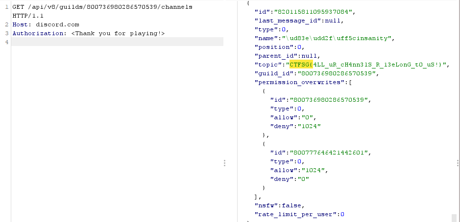

Wrote one simple challenge for our first CTF - here's the writeup!

---

## Misc

---

# Insanity Check

#### Category: Misc | 43 solves | Easy

<details>
  <summary>Challenge Description</summary>
  
We hid a flag in one of the private channels on the <a href="https://discord.com/invite/Gn8DXWBV88">CTF.SG CTF discord</a>. Can you find it?
</details>

This was intended to be a slightly harder version of a sanity check, but because of the description there should be no guessing. 

The [Discord API documentation](https://discord.com/developers/docs/resources/channel#channel-object) shows that all channels and their topics on Discord can be retrieved via the API, regardless of whether it is private or not.

Hence we can simply solve it by calling [Get Guild Channels](https://discord.com/developers/docs/resources/guild#get-guild-channels) with a valid `Authorization` token of *any* user in the discord server.


```
GET /api/v8/guilds/00736980286570539/channels HTTP/1.1
Host: discordapp.com
Authorization: <redacted>
```

You'll get the flag in the JSON response.

```json
{"id": "820115811095937084", "last_message_id": null, "type": 0, "name": "\ud83e\udd2f\uff5cinsanity", "position": 0, "parent_id": null, "topic": "CTFSG{4LL_uR_cH4nn3lS_R_13eLonG_t0_uS!}", "guild_id": "800736980286570539", "permission_overwrites": [{"id": "800736980286570539", "type": 0, "allow": "0", "deny": "1024"}, {"id": "800777646421442601", "type": 0, "allow": "1024", "deny": "0"}], "nsfw": false, "rate_limit_per_user": 0},
```



This was intended to be an educational challenge and for people who want to OSINT challenges/categories before a CTF starts in a CTF Discord server. You can also make some admins panic by asking them what does `private channel name` mean to them for the lulz. 


<details>
  <summary>FLAG</summary>
  
  CTFSG{4LL_uR_cH4nn3lS_R_13eLonG_t0_uS!}
</details>

***