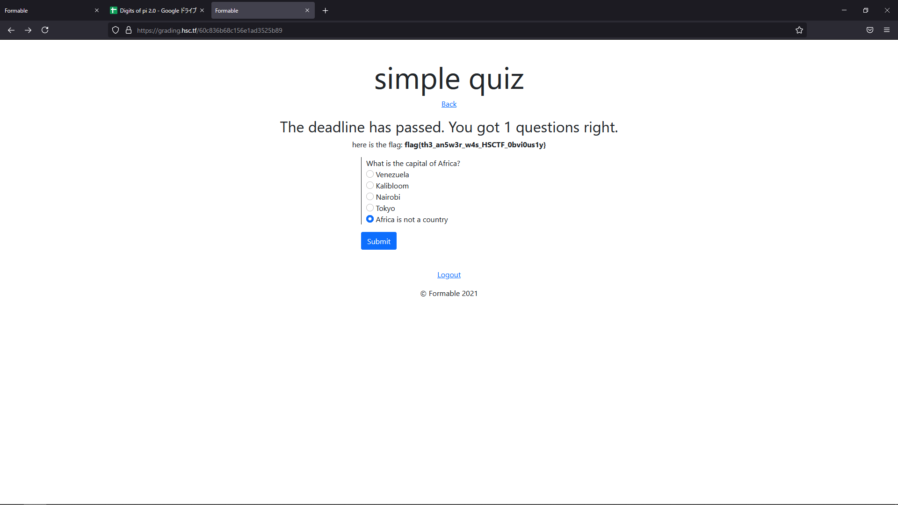

I solved all web and the OSINT miscs with CTF.SG. Great easy-intermediate ctf overall, had fun with the high school members on our team. 

---

## Misc

---

# c-brother-2

#### Category: Misc, Osint | 490 points

<details>
  <summary>Challenge Description</summary>
  
It looks like AC01010 and JC01010's third twin has changed their profile picture!
<br />
Note: It may be helpful to solve c-brother-1 before c-brother-2
<br />
Please respect the privacy of our organizers and do not OSINT any of our organizers. None of the flags are hidden on our own social media sites or other accounts. This challenge includes BC01010 and this person only. Do not visit any other profiles, including JC01010, AC, or any other organizers. Thank you.
</details>

This was an OSINT challenge that builds upon c-brother-1. The keyword in this challenge is 'profile picture change'. From my study of Discord, I know that old profile pictures are deleted off the server after it changes so the solve route seems to point to the Youtube account linked on BC01010's discord profile page.

Visiting the youtube page again, I copied all the links on the page and pasted each into the Wayback Machine and opened every snapshot before June 15 (before the CTF started). 

And then I found the flag on the cached page of https://www.youtube.com/channel/UCqZq81jZcdjAHQJ3UtAbdaA/about.

You can check it for yourself [here](http://web.archive.org/web/20210614150352if_/https://www.youtube.com/channel/UCqZq81jZcdjAHQJ3UtAbdaA/about)


As you can see, the profile image is completely different from the current bird photo.


Magnifying it and then transcribing the text in the image, we got the flag! 


<details>
  <summary>FLAG</summary>
  
   flag{f1ag_fl@g_fla6}
</details>

***

---

## Web

---

# message-board

#### Category: Web | 329 points

<details>
  <summary>Challenge Description</summary>
  
Your employer, LameCompany, has lots of gossip on its company message board: message-board.hsc.tf. You, Kupatergent, are able to access some of the tea, but not all of it! Unsatisfied, you figure that the admin user must have access to ALL of the tea. Your goal is to find the tea you've been missing out on.
<br />
Your login credentials: username: kupatergent password: gandal
<br />
Server code is attached (slightly modified).
</details>

Logging in with the provided credentials, we are given a page that ends with `no flag for you`. Also, if we check the cookies header, there is an auth token which is `Set-Cookie: userData=j%3A%7B%22userID%22%3A%22972%22%2C%22username%22%3A%22kupatergent%22%7D; Path=/`. Running it through a URL decoder for ease of reading, it is `j:{"userID":"972","username":"kupatergent"}`. 

Since it isn't hashed but only encoded, we can probably control this value.

Reading the attached source code below...

**app.js**
```javascript
app.get("/", (req, res) => {
    const admin = users.find(u => u.username === "admin")
    if(req.cookies && req.cookies.userData && req.cookies.userData.userID) {
        const {userID, username} = req.cookies.userData
        if(req.cookies.userData.userID === admin.userID) res.render("home.ejs", {username: username, flag: process.env.FLAG})
        else res.render("home.ejs", {username: username, flag: "no flag for you"})
```

I noticed that the cookie value is checked for the admin ID and the admin username. However, the source code only provides the admin username, which is `admin`. So we have to guess the admin ID to get the flag. 

Usually web challenges don't require / forbid bruteforcing, but I asked the admins and they said that bruteforcing is required. So I fired off my intruder and got the admin user ID which is `768`.

Final payload is the URL-encode of the `userData` cookie: `j:{"userID":"768","username":"admin"}`


<details>
  <summary>FLAG</summary>
  
   flag{y4m_y4m_c00k13s}
</details>

***

# grading

#### Category: Web | 403 points

<details>
  <summary>Challenge Description</summary>
  
Did you attend online school this year?
<br />
Good, because you'll need to register at grading.hsc.tf and get an A on "simple quiz" to find the flag.
<br />
Server code is attached.
</details>

This challenge is simple - simply give the correct answer on the first quiz to receive the flag.

Looking at the code...

**app.js**
```javascript
            const question1 = {
                question: "What is the capital of Africa?",
                choices: [
                    "Venezuela",
                    "Kalibloom",
                    "Nairobi",
                    "Tokyo",
                    "Africa is not a country"
                ],
                answer: "Africa is not a country",
                submission: "Kalibloom",
            }

```

We can find the answer to the question. However, posting it returns a `too late` JSON response and does not seem to store the answer in the MongoDB database.

We can see the logic here:

```javascript
.post(authMW, (req, res) => {
    const now = Date.now()
    const form = req.user.forms.id(req.params.formID)
    if(now > form.deadline) {
        res.json({response: "too late"})
    } 
```

The server checks for the current time using `Date.now()` and rejects the response if it is past the deadline, which is on 13th of June - before the CTF even started. Since it is checked server-side, there is no way to manipulate this value. Hence I knew that there must be another way.

Looking at the portion of the code that gives the flag, I noticed that the GET method uses a different logic to check for the validity of the submission, as follows:

```javascript
.get(authMW, (req, res) => {
    const formID = req.params.formID
    const form = req.user.forms.id(formID)
    if(!form) {
        res.redirect("/") // not found
    } else {

        const payload = {
            name: form.name,
            deadline: form.deadline,
            questions: []
        }

        for(let q in form.questions) {
            form.questions[q] = req.user.questions.id(form.questions[q])
        }

        after = {}

        const late = Date.now() > form.deadline
        after.late = late

        if(late) {
            let grade = 0
            for(let q of form.questions) {
                if (q.submission == q.answer) grade += 1
            }

            after.grade = grade
        }

        after.flag = process.env.FLAG
```

Basically if the answer is correct, the `grade` variable will be equals to 1, which leads to the flag. 

Here's the above explanation in image form:


Hence I changed the method to GET from POST and got the flag!




Due to the organizers' poor implementation of this problem (letting people choose their own username/passwords), I believe that dozens of teams got the unintended solution which is to just login to `admin:admin` that has the flag thanks to some Good Samaritan. The admins only noticed this and deleted the account about 36 hours into the CTF, which was too late. Also they did not delete other accounts like `abc:abc` which may have had the flag. 

<details>
  <summary>FLAG</summary>
  
   flag{th3_an5wr_w4s_HSCTF_0bvi0us1y}
</details>

***

# digits-of-pi

#### Category: Web, Misc | 403 points

<details>
  <summary>Challenge Description</summary>
  
There's more to this spreadsheet than meets the eye. https://docs.google.com/spreadsheets/d/1y7AxYvBwJ1DeapnhV401w0T5HzQNIfrN1WeQFbnwbIE/edit
</details>

This is an Excel spreadsheet, as ordinary as it can get. Except it seems to have hidden sheets and I assumed that the flag is in there.

I found the flag simply by using the Find function and searching for a string that starts with `flag`. 


<details>
  <summary>FLAG</summary>
  
   flag{hidden_sheets_are_not_actually_hidden}
</details>

***

# digits-of-pi-2

#### Category: Web, Misc | 481 points

<details>
  <summary>Challenge Description</summary>
  
This spreadsheet is Secure™ https://docs.google.com/spreadsheets/d/1NX9nUMrpaxGqChQ7ROzITDtlxaz5McSsN5BMs-o5k-M/edit
</details>

Same type of problem. What people don't know is that hidden data on google sheets is actually not hidden. 

Tapping on the `Show Formula` shortcut, we notice that on cell A2, it imports a sheet with the ID `1MD4O3pFoQY59_YoW_ZzxRUg-rBgHFlAaYxnNABmqc3A`. Unfortunately we have no access to it and the challenge is unsolvable, or is it?

Checking the network traffic and filtering for `1MD4O3pFoQY59_YoW_ZzxRUg-rBgHFlAaYxnNABmqc3A` in the request body, and reading the responses, we found the flag without the usual wrapped brackets!


<details>
  <summary>FLAG</summary>
  
   flag{m4k3_sur3_t0_r3str1ct_y0ur_imp0rtr4ng3s}
</details>

***

# big-blind

#### Category: Web | 481 points

<details>
  <summary>Challenge Description</summary>
  
https://big-blind.hsc.tf/
</details>

No source, no description - just the link. Big blind is a poker term, but I had a feeling it refers to Blind SQLI here so I started checking for that first.

Entering any credential brings us back to the login page with the same error so we have no idea if we got the correct credentials. 

Anyway I used a single quote `'` to check for the presence of SQLI and it returned a 500 error, so we know that there is a possiblity (or a WAF). 

Since it's completely blind, I decided to use the `sleep` function next to check there really is an SQLI. Using this payload as the username: `admin ' and (select*from(select(sleep(20)))a)--`, I found that the request takes approximately 20 seconds to return. Changing the sleep value to 10 and 5, I got 10 seconds and 5 seconds responses respectively. I was 100% sure there was a time-based SQLI at this point, and that the backend must be using MySQL. 

Since the organizers said bruteforce is okay, I decided to be lazy and use sqlmap to dump the database instead of writing a script to bruteforce every character of the flag. 


<details>
  <summary>FLAG</summary>
  
   flag{any_info_is_good_info}
</details>

***

# NRC

#### Category: Web | 100 points

<details>
  <summary>Challenge Description</summary>
  
Find the flag :)
<br />
no-right-click.hsc.tf
</details>

Including this for the completeness. 

Visiting the page and inspecting the source, we find two custom files - `index.js` and `useless-file.css`. Opening both files, we got the flag from the last line of the CSS, enclosed in a comment.


<details>
  <summary>FLAG</summary>
  
   flag{keyboard_shortcuts_or_taskbar}
</details>

***