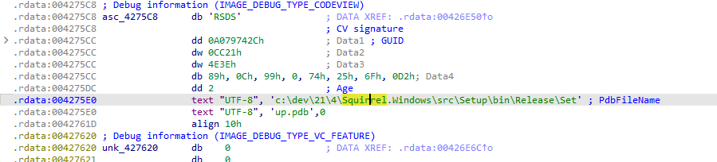
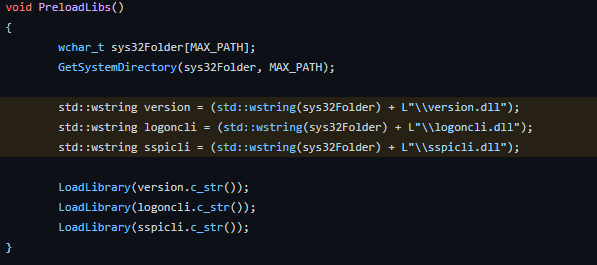

While bug hunting, I stumbled upon an open source repository which had been the cause of several of my bug bounty reports. This post goes into the details.

---

## CVE-2022-46330

---

### Affected Versions
All installers generated by Squirrel.Windows 2.0.1 and earlier.

CVSS Base Score: 7.8 | CVSS:3.1/AV:L/AC:L/PR:N/UI:R/S:U/C:H/I:H/A:H

## Fixed Firmware
None.     
**Workaround:** Build Squirrel.Windows using the latest source code from the `develop` branch and use it to generate an installer. 

### Introduction

Squirrel.Windows is both a toolset and a library that provides installation and update functionality for Windows desktop applications. Installers generated by Squirrel.Windows 2.0.1 and earlier contain an issue with the DLL search path, which may lead to insecurely loading Dynamic Link Libraries. As a result, arbitrary code may be executed with the privilege of the user invoking the installer.

To date, there has been over [1,000,000 downloads](https://www.nuget.org/packages/squirrel.windows/) of Squirrel.Windows and the [Github Repository](https://github.com/squirrel/Squirrel.Windows) has over 6,600 stars. Although I have gotten a lot of Bugcrowd points and bounties resulting from this CVE, I felt it was time to do my duty as a security professional and report the root cause.

### Bug Discovery 

While fuzzing many Windows executables for vulnerabilities, I noticed that some of them shared the same category of properties. One of these was having only `urlmon.dll` being loaded insecurely, which I eventually identified as `Squirrel.Windows` and shared it with the developers of [one](https://hackerone.com/reports/1519437) of my bug bounty reports.  

After that, tracing it from source to sink was relatively simple.

`urlmon.dll` was noticeably missing from the [code](https://github.com/Squirrel/Squirrel.Windows/blob/master/src/Setup/winmain.cpp#L23-L25) that handles DLL preloads.

The developer of 8x8 reported some of this information by making [an issue](https://github.com/Squirrel/Squirrel.Windows/issues/1801) in Squirrel.Windows, after which the Squirrel.Windows developer merged a [pull request](https://github.com/Squirrel/Squirrel.Windows/actions/runs/2416919466) into the `develop` branch.

### The Exploit

It's very rudimentary to exploit DLL Hijacking, given the age of the vulnerability. You can find lots of tools out there like [Sigma](https://github.com/SigmaHQ/sigma/tree/master/rules/windows/image_load). 

For my bug bounties, what I usually do is to inject custom shellcode into the `urlmon.dll`, to make it execute another program like `C:\Windows\System32\calc.exe`. And then I'll put it into the target unprivileged directory, which is usually `Downloads` as it can be accessed by an unprivileged local user. This leads to privilege escalation and the arbitrary code may be invoked by the administrator, leading to full system compromise at maximum impact.

### Afterthoughts

OSEP and OSED has a lot stuff in the learning materials that teach you exactly how to exploit Windows bugs like this (and more!) if you need some hand-holding. I still have not finished my coursework for either, due to procrastinating by using the taught exploits to hack Windows applications. It's a fun break from Web hacking, and while I find that I am not earning as much bounties, it is just that much more fun. 

### Timeline    

**2022-03-23 14:11:16 JST** - Reported to 8x8  
**2022-03-23 17:40:18 JST** - Added root cause      
**2022-03-23 17:58:38 JST** - Bug Triaged           
**2022-04-14 17:01:06 JST** - 8x8 Developer Reported to Squirrel.Windows    
**2022-06-01 03:20:00 JST** - Squirrel.Windows Developer pushes fix        
**2022-09-22 12:19:32 JST** - 8x8 HackerOne report disclosed    
**2022-11-14 11:35:02 JST** - Reported to JPCERT/CC      
**2022-11-21 12:14:31 JST** - Acknowledgement from JPCERT/CC     
**2022-12-21 12:01:24 JST** - CVE Published              
**2023-01-09 15:15:15 JST** - Blog post published                   

### Links 
- [CVE-2022-46330](https://nvd.nist.gov/vuln/detail/CVE-2022-46330)
- [JVN#29902403](https://jvn.jp/en/jp/JVN29902403/index.html)
- [JVNDB-2022-000102](https://jvndb.jvn.jp/ja/contents/2022/JVNDB-2022-000102.html)
- [CVE Analysis by Arch Cloud Labs](https://www.archcloudlabs.com/projects/cve-2022-46330/)

***